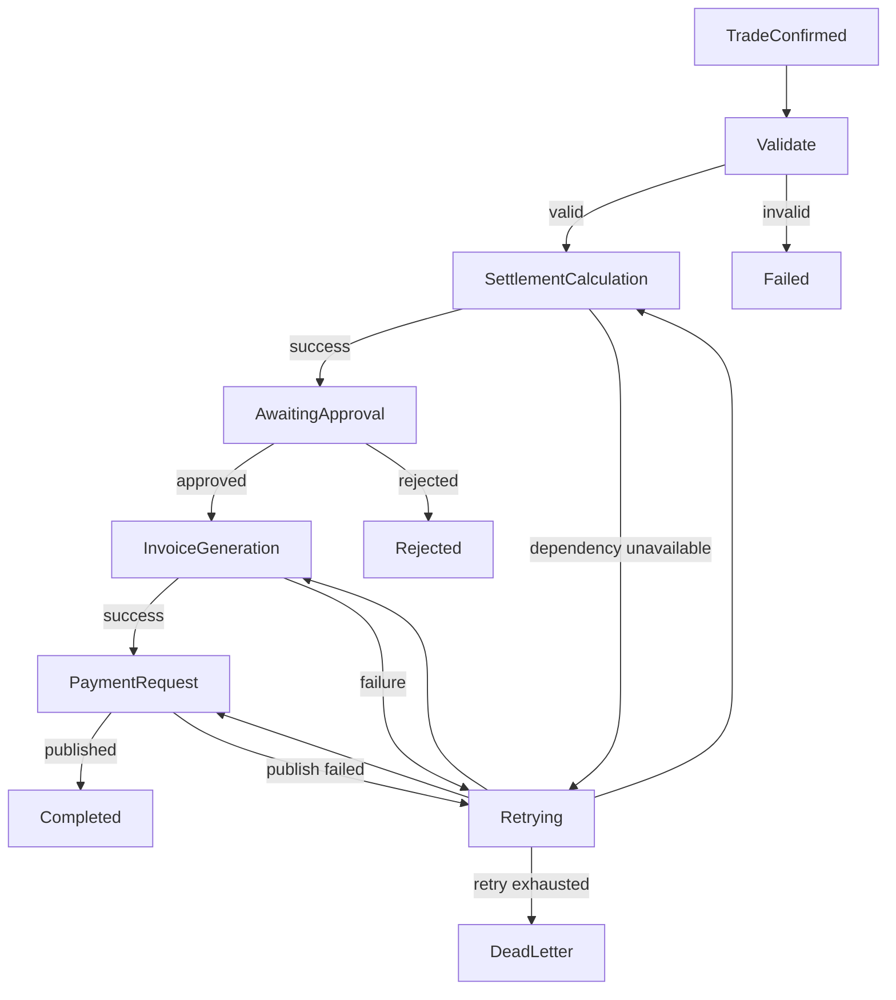
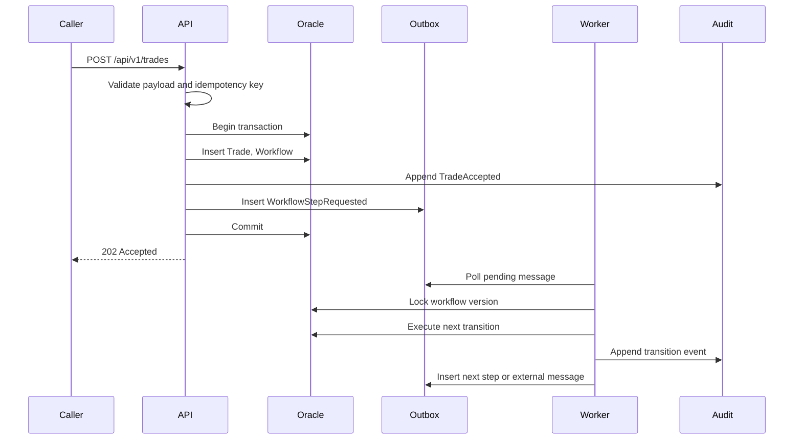
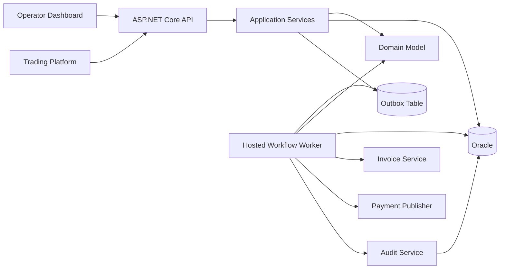
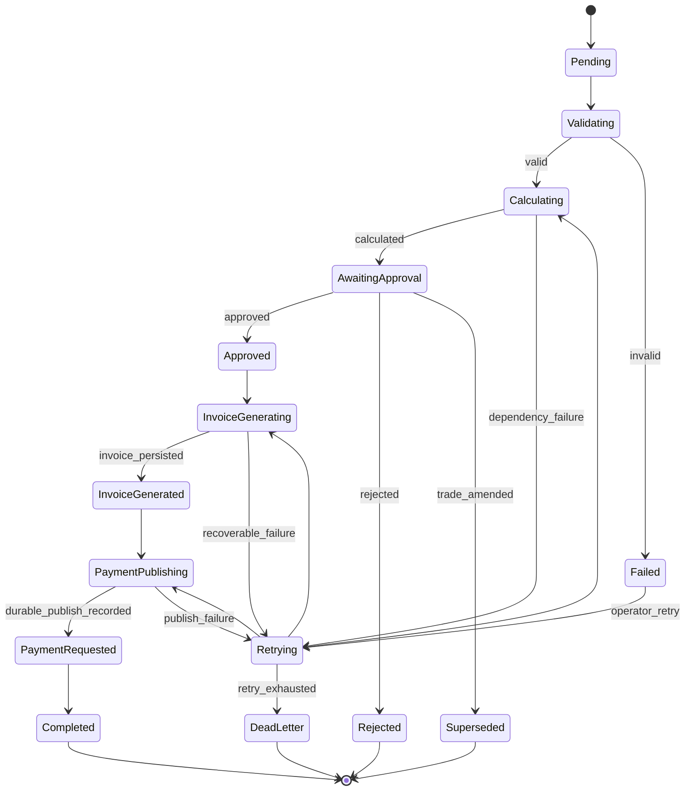
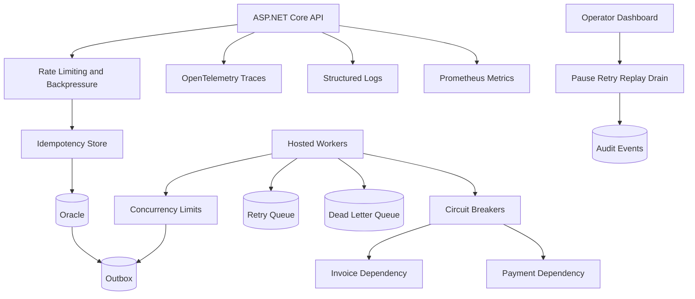

# Settlement Orchestrator Platform - System Design

## Objective

Build a C# / ASP.NET Core 9 backend system that orchestrates the post-trade settlement lifecycle for commodities trades.

The system does not execute trades, price trades, or own market risk. It owns durable settlement orchestration, auditability, operational recovery, and operator visibility.

Target outcome:

> A confirmed trade either reaches a valid settlement outcome or stops in a state that operations can inspect, retry, or close with a recorded reason.

Working rules:

- Bound risk at the workflow and step level. A bad trade, slow dependency, or operator retry stays isolated from unrelated settlements.
- Write assumptions down close to where they matter: schema, configuration, contract, test, or runbook.
- Treat Oracle sessions, CPU, memory, disk, network, worker slots, audit storage, and operator attention as finite budgets.
- Prefer correctness, auditability, and recovery over raw latency.
- Assume duplicate input, reordered input, partial failure, stale reads, schema drift, restarts, and timeouts.
- Measure a stage before optimizing it.
- Include failure paths in the first design, not as later operational cleanup.

## Problem

### Known

- A trading platform emits confirmed commodities trades.
- The settlement platform receives confirmed trades through an API or event ingestion boundary.
- Each accepted trade creates or resumes a settlement workflow.
- The workflow validates the trade, calculates settlement, waits for approval, generates an invoice, publishes a payment request, and reaches a terminal outcome.
- Externally visible actions are written to audit.
- Operators need enough state to intervene without querying Oracle by hand.
- The design covers process crashes, Kubernetes restarts, Oracle outages, duplicate requests, retries, and partial completion.
- The first implementation is C# / ASP.NET Core 9 with Oracle persistence.

### Unknown

- Settlement rules per commodity.
- FX conversion policy.
- Tax treatment.
- Approval thresholds.
- Amendment frequency.
- External payment provider behavior.
- Invoice format and downstream contract.
- Exact volume distribution by commodity, counterparty, and settlement date.
- Required data retention periods by record type.
- Whether trade confirmation arrives by REST, file, message bus, or multiple channels.

These belong in configuration, versioned contracts, or documented assumptions, not hidden constants inside workflow code.

### Known Unknowns

- Duplicate trade confirmations.
- Late trade confirmations.
- Trade amendments during settlement.
- Message reordering.
- Oracle outages.
- Transaction timeouts.
- ASP.NET worker crashes halfway through a workflow step.
- Kubernetes rolling restarts.
- Partial workflow completion.
- Operator retry after a downstream side effect.
- Schema evolution while old workflows are still active.
- Clock skew between services.
- Payment request published but acknowledgement lost.
- Invoice generated but response lost.

## Clarifying Questions

### Happy Path

- What exact event or API call starts settlement?
- Can one trade create multiple settlements?
- Can a settlement be recalculated?
- Can an invoice be regenerated?
- Can approvals expire?
- Can a settlement be cancelled before payment?
- Who approves: user, role, team, or rule engine?
- What makes a workflow complete?
- What is the SLA from trade confirmation to payment request?

### Adversarial

- What happens if the same trade is submitted twice with the same idempotency key?
- What happens if the same trade is submitted twice with different payloads?
- What happens if a trade amendment arrives after approval?
- What happens if approval arrives after cancellation?
- What happens if invoice generation succeeds but the API call times out?
- What happens if payment request publish succeeds but acknowledgement is lost?
- What happens if a worker crashes after writing state but before writing audit?
- What happens if a worker crashes after calling an external dependency but before persisting the result?
- What happens if Oracle is available but slow enough to trigger retries?
- What happens if a retry storm increases p99 latency and starves new trades?

### Unforeseen Risks

- Clock skew breaks timeout and expiry decisions.
- Network partitions create inconsistent dependency health.
- Split-brain deployments run incompatible workflow code.
- Retry amplification saturates Oracle sessions.
- Payload corruption passes syntactic validation but violates domain rules.
- Schema drift causes old workflow payloads to fail deserialization.
- Audit storage grows faster than expected.
- Operator retries a workflow with insufficient context.
- Metrics are too coarse to identify the failing stage.

### UX

#### Developer

- Swagger/OpenAPI available locally.
- Docker Compose for API and Oracle.
- k3s manifests for local Kubernetes.
- Seed data for common workflow states.
- Contract tests for API and outbound event shape.
- Fast unit test feedback without Oracle.
- Integration tests against Oracle container.
- Clear correlation IDs in logs and traces.

#### Operator

- Search by trade id, workflow id, settlement id, invoice id, payment request id, counterparty, status, and correlation id.
- View workflow state, failed step, retry count, next retry time, and last error.
- Retry failed workflow from the last recorded recovery point.
- Replay an event only when idempotency allows it.
- Pause and resume workflow processing.
- Drain queues before deployment.
- View dead-letter events.
- View full audit history.
- See p50, p95, and p99 stage latency.

#### Service

- `/health`, `/ready`, and `/live` endpoints.
- Structured JSON logs.
- Correlation IDs and causation IDs.
- Distributed tracing through API, workflow, Oracle, and background workers.
- Prometheus metrics per stage.
- Bounded queues and backpressure.
- Timeouts and circuit breakers around dependencies.

## FR

### FR1 - Receive Confirmed Trade

Acceptance criteria:

- Valid trade is persisted.
- Duplicate trade does not create a second workflow.
- Workflow is created in `Pending` state.
- Audit event is appended.
- Outbox message is written in the same transaction as workflow creation.
- API returns stable response for idempotent retries.

Positive tests:

- Valid trade creates trade, workflow, audit event, and outbox message.
- Retry with same idempotency key returns existing result.

Negative tests:

- Missing trade id rejected.
- Invalid commodity rejected.
- Duplicate trade with conflicting payload rejected.
- Payload larger than configured limit rejected.

Test types:

- Unit validation tests.
- API contract tests.
- Oracle integration tests.
- Fuzz tests for malformed payloads.
- Idempotency tests.

### FR2 - Calculate Settlement

Acceptance criteria:

- Settlement amount is computed using versioned rules.
- Calculation input and output are persisted.
- Workflow moves to `AwaitingApproval`.
- Audit event records rule version, inputs hash, output hash, and correlation id.

Positive tests:

- Known trade produces expected settlement.
- Calculation is repeatable for the same rule version and input.

Negative tests:

- Unsupported commodity fails with recoverable error.
- Missing FX rate moves workflow to retry or manual intervention.
- Rule version mismatch is rejected.

Test types:

- Unit tests for rules.
- Property tests for invariants.
- Integration tests for persisted calculation.
- State machine tests.

### FR3 - Approval Workflow

Acceptance criteria:

- Settlement progresses to invoice only after approval.
- Approval is recorded with actor, role, timestamp, correlation id, and decision.
- Rejection moves workflow to a terminal or operator-action state.
- Approval after cancellation is rejected.

Positive tests:

- Authorized approval progresses workflow.
- Rejection records reason and stops invoice generation.

Negative tests:

- Unauthorized approval rejected.
- Duplicate approval is idempotent.
- Approval for wrong workflow version rejected.

Test types:

- Unit authorization tests.
- API contract tests.
- Integration tests.
- Race condition tests.

### FR4 - Generate Invoice

Acceptance criteria:

- Exactly one invoice is created per settlement version.
- Invoice id is unique.
- Invoice generation is idempotent.
- Generated invoice is auditable.
- Workflow progresses only after invoice persistence.

Positive tests:

- Approved settlement creates invoice.
- Retry after timeout returns existing invoice.

Negative tests:

- Duplicate invoice creation blocked by unique constraint.
- Invoice generation failure moves workflow to retry.
- Invoice generation after payment is rejected.

Test types:

- Unit tests.
- Oracle uniqueness tests.
- Idempotency tests.
- Failure injection tests.

### FR5 - Publish Payment Request

Acceptance criteria:

- Payment request id is created once per invoice.
- Outbox dispatch is at-least-once.
- Consumer-facing event contains idempotency key.
- Workflow reaches `PaymentRequested` only after durable publish record.

Positive tests:

- Invoice creates payment request outbox message.
- Dispatcher marks message as published after successful send.

Negative tests:

- Dispatcher crash before marking published causes a republish with the same payment request id.
- Duplicate dispatch uses same payment request id.
- Downstream timeout moves message to retry.

Test types:

- Unit tests.
- Outbox integration tests.
- Contract tests.
- Chaos tests for worker crash.

### FR6 - Trade Amendment

Acceptance criteria:

- Amendment does not mutate paid settlement history.
- New workflow version is created where allowed.
- Old active workflow is invalidated or superseded.
- Audit chain links original trade, amendment, old workflow, and new workflow.

Positive tests:

- Amendment before approval creates new workflow version.
- Amendment after payment creates compensating workflow if policy allows.

Negative tests:

- Amendment with stale version rejected.
- Amendment after terminal state follows configured policy.

Test types:

- State machine tests.
- Integration tests.
- Concurrency tests.
- Contract tests.

### FR7 - Operator Retry

Acceptance criteria:

- Retry resumes from the last persisted recovery point.
- Retry does not duplicate invoice or payment request.
- Retry action is audited.
- Retry count and next retry time are updated.
- Retry that can repeat an external side effect requires override permission.

Positive tests:

- Failed calculation retry succeeds.
- Failed outbox dispatch retry republishes with the same idempotency key.

Negative tests:

- Retry of completed workflow rejected.
- Retry with stale workflow version rejected.
- Retry while processing already locked is rejected or queued.

Test types:

- API tests.
- State machine tests.
- Concurrency tests.
- Failure injection tests.

## Capacity Planning

Assumptions for first release:

- Traders: 10.
- Operations staff: 20.
- Trades per day: 10,000.
- Peak trade intake: 50 trades/sec.
- Target API throughput: 100 req/sec.
- Worker concurrency: 20 active workflow steps.
- Oracle connection pool: 100 per API replica, capped below database session budget.
- Oracle maximum sessions budget: 500.
- Average trade payload: 8 KB raw JSON.
- Persisted trade row: 5 KB.
- Settlement row: 3 KB.
- Workflow row: 2 KB.
- Audit event row: 1 KB.
- Outbox message row: 2 KB.
- Average audit events per workflow: 10.
- Average outbox messages per workflow: 5.

Raw daily storage estimate:

- Trade data: `10,000 * 5 KB = 50 MB/day`.
- Settlement data: `10,000 * 3 KB = 30 MB/day`.
- Workflow data: `10,000 * 2 KB = 20 MB/day`.
- Audit data: `10,000 * 10 * 1 KB = 100 MB/day`.
- Outbox data before retention cleanup: `10,000 * 5 * 2 KB = 100 MB/day`.
- Total operational write footprint before indexes: `300 MB/day`.
- With 2.5x index and metadata overhead: `750 MB/day`.
- Annual footprint: `~274 GB/year`.
- Five-year footprint: `~1.37 TB`.

Rates and fanout:

- 10,000 trades/day over 8 business hours = `0.35 trades/sec average`.
- Peak factor from average to peak: `50 / 0.35 = 143x`.
- Each trade fans out to roughly 1 workflow, 1 settlement, 1 approval task, 1 invoice, 1 payment request, 10 audit events, and 5 outbox messages.
- Peak database writes at 50 trades/sec and 20 writes/workflow = `1,000 writes/sec` before retries.
- With 2x retry amplification during dependency degradation = `2,000 write attempts/sec`.

Latency targets:

- API p50: `<100 ms`.
- API p95: `<300 ms`.
- API p99: `<500 ms`.
- Workflow stage p99 under normal load: `<2 sec`.
- End-to-end trade-to-payment-request target: `<5 min` excluding human approval.
- Operator retry API p99: `<750 ms`.

Resource scheduling:

- API CPU is mostly spent on validation, serialization, authentication, and JSON logging.
- Worker CPU is mostly spent on transition logic and serialization.
- Oracle is the primary constrained queue: sessions, locks, IOPS, redo logs, and index maintenance.
- Network is a queue for API ingress, Oracle calls, telemetry export, and future message bus dispatch.
- Disk is a queue for Oracle writes, redo, archive logs, audit growth, and Prometheus/Grafana storage.

Cache assumptions:

- First version does not depend on cache correctness.
- Configuration/rules cache target hit rate: `>99%`.
- Cache miss falls back to the durable source or fails explicitly.
- Cache entries are versioned; stale settlement rules fail closed.

## NFR

### Invariants

- Trade id is immutable.
- Trade version is monotonic.
- Workflow version is monotonic.
- A workflow transition is persisted before the next step runs.
- A paid settlement is immutable.
- Audit is append-only.
- Invoice id is unique.
- One settlement version maps to at most one invoice.
- Payment request id is unique.
- External side effects use stable idempotency keys.
- Operator actions are always auditable.

### Guarantees

- No duplicate settlement for the same trade version.
- Idempotent trade intake.
- Idempotent approval endpoint.
- Idempotent invoice generation.
- At-least-once outbox delivery.
- Effectively-once side effects through idempotency keys and uniqueness constraints.
- Recoverable workflow failures.
- Eventually consistent workflow progress when dependencies recover.
- No silent data loss.

### Constraints

#### Economic

- Oracle licensing and local setup cost are accepted only because Oracle is common in enterprise trade operations.
- Azure cost is budgeted by environment and rollout phase.
- Audit retention increases storage cost; retention policy is a design input, not an afterthought.
- Operator time is expensive; dashboards reduce manual database inspection.
- Observability cost is controlled through sampling, retention, and metric cardinality limits.

#### Operational

- Availability target: `99.9%`.
- Recovery time objective: `<30 min`.
- Recovery point objective for committed workflow state: `0 committed transactions lost`.
- Rolling deployments required.
- Zero manual database edits.
- Local environment is reproducible.
- Production actions have runbooks.

### Decoded Reality

This section states the formal model behind the design. Implementation choices are checked against these constraints.

#### Graph Theory

Model the workflow as a directed graph:

```text
G = (V, E)

V = workflow states
E = valid transitions between states

state(workflow, t) ∈ V
transition(workflow, event) ∈ E
```

For this system:

```text
V = {
  Pending,
  Validating,
  Calculating,
  AwaitingApproval,
  Approved,
  InvoiceGenerating,
  InvoiceGenerated,
  PaymentPublishing,
  PaymentRequested,
  Completed,
  Failed,
  Retrying,
  DeadLetter,
  Rejected,
  Superseded
}
```

Transition validity:

```text
∀ transition s1 -> s2:
  (s1, s2) ∈ E

Invalid transitions are rejected, audited, and counted.
```

Terminal state rule:

```text
Terminal = {Completed, Rejected, Superseded, DeadLetter}

∀ s ∈ Terminal:
  out_degree(s) = 0

Exception:
  DeadLetter may be moved to Retrying only by an audited operator action
  with explicit override permission.
```

Version monotonicity:

```text
workflow_version(t + 1) > workflow_version(t)
```

No skipped persistence:

```text
transition_applied => state_persisted ∧ audit_appended
```

The graph:



Design commitments:

- The state machine rejects illegal edges.
- Oracle optimistic concurrency enforces monotonic workflow versions.
- Tests cover each valid edge and the important invalid edges.
- Failure states are part of the graph.

#### Queue Theory

Model every constrained resource as a queue:

```text
ResourceQueue = (λ, μ, c, ρ)

λ = arrival rate
μ = service rate per worker/server
c = parallel servers / workers / sessions
ρ = utilization = λ / (c * μ)
```

Stability condition:

```text
ρ < 1
```

Operational target:

```text
ρ <= 0.70 under normal load
ρ <= 0.85 under short peak load
```

Retry amplification:

```text
effective_arrival_rate = base_arrival_rate * (1 + retry_rate)

λ_effective = λ_base * A
A = 1 + average_retries_per_unit_of_work
```

If payment publishing fails and each item retries 3 times:

```text
A = 4
λ_effective = 50 trades/sec * 4 = 200 workflow attempts/sec
```

Bounded queue rule:

```text
queue_depth <= max_queue_depth
oldest_message_age <= max_allowed_age
```

Backpressure trigger:

```text
if queue_depth > threshold
or oldest_message_age > threshold
or Oracle ρ > 0.70
then reduce intake or worker concurrency
```

Queues in this system:

- API request queue.
- ASP.NET thread pool.
- Oracle connection pool.
- Oracle locks and redo writes.
- Outbox table.
- Worker queue.
- Retry queue.
- Dead-letter queue.
- Telemetry export queue.
- Operator work queue.

Latency physics:

```text
end_to_end_latency =
  api_latency
  + queue_wait_time
  + workflow_step_latency
  + dependency_latency
  + retry_delay
  + operator_wait_time
```

For automated stages:

```text
p99(end_to_end) >= max(
  p99(api),
  p99(outbox_wait),
  p99(worker_step),
  p99(oracle),
  p99(external_dependency)
)
```

Tail latency rule:

```text
Operators experience p95/p99 latency during incidents, not averages.
```

Design commitments:

- Queues expose depth, age, dequeue rate, error rate, and retry rate.
- Retries use capped exponential backoff with jitter.
- Worker concurrency is configurable at runtime or rollout time.
- Intake returns `429` or `503` before Oracle saturation turns into cascading failure.

#### Information Theory

Model a workflow transition as an information-carrying event:

```text
Event = {
  identity,
  ordering,
  causality,
  actor,
  state_delta,
  input_reference,
  output_reference,
  error_context,
  time_context
}
```

Minimum information required:

- Workflow id.
- Trade id.
- Trade version.
- Workflow version.
- Step name.
- Previous state.
- Next state.
- Correlation id.
- Causation id.
- Idempotency key.
- Actor.
- Timestamp.
- Rule version.
- Input hash.
- Output hash.
- Error classification.

Information preservation rule:

```text
H(event_after_persistence) >= H(event_required_for_recovery)
```

Persisted data needs enough information to:

- Reconstruct what happened.
- Decide whether retry can repeat a side effect.
- Prove which actor or system caused the transition.
- Correlate API request, worker execution, Oracle write, and outbound side effect.
- Detect duplicate, stale, reordered, or conflicting inputs.

Entropy loss examples:

```text
"Failed" < "Payment publish timed out after provider accepted request"

"Retried" < "Retried invoice generation attempt 3 using idempotency key INV-123"

"Updated workflow" < "Transitioned Calculating -> AwaitingApproval with rule version POWER-SETTLEMENT-v4"
```

Design commitments:

- Generic failure fields are not enough.
- Audit events contain causation and correlation.
- Payload hashes are required where full payload retention is too expensive.
- Error categories use a controlled vocabulary.

#### Distributed Correctness

Model command handling as a deterministic function over current durable state:

```text
next_state = f(current_state, command, version, idempotency_key)
```

Idempotency requirement:

```text
f(s, command, version, key) = same_result
for repeated submissions with the same key and same payload hash
```

Conflict requirement:

```text
same business identity + different payload hash => conflict
```

Ordering requirement:

```text
accepted_version = current_version + 1
```

Stale command rejection:

```text
command.expected_version < current_version => reject as stale
```

Optimistic concurrency:

```text
UPDATE workflow
SET state = next_state,
    version = version + 1
WHERE workflow_id = :id
  AND version = :expected_version
```

If rows affected equals `0`, another actor won the race. The command reloads state and resolves as idempotent success, conflict, or retry.

External side effect rule:

```text
external_effect_id = deterministic_id(workflow_id, step, workflow_version)
```

This prevents retry from creating a second invoice or payment request.

#### Data Movement

Data movement cost model:

```text
movement_cost =
  serialization_cost
  + network_cost
  + database_read_cost
  + database_write_cost
  + index_maintenance_cost
  + telemetry_export_cost
```

Hot-path rule:

```text
Pass identifiers and versions between stages, not full payloads.
```

Payload storage rule:

```text
store_once(payload)
reference_by(id, version, hash)
```

Batching rule:

```text
batch_size balances throughput against p99 latency.
```

Backpressure rule:

```text
if downstream_service_time increases,
then reduce upstream admission before queues grow without limit.
```

Design commitments:

- Batch outbox polling.
- Paginate audit search.
- Hash and reference large payloads.
- Record serialization size, payload size, and batch size where relevant.

### Qualities To Optimize For

| Quality | Direction | Target |
| --- | --- | --- |
| Financial correctness | Maximize | No duplicate settlement or payment request |
| Auditability | Maximize | 100% externally visible actions audited |
| Recoverability | Maximize | RTO `<30 min` |
| Data loss | Minimize | Zero committed workflow state loss |
| API latency | Target | p99 `<500 ms` |
| Workflow throughput | Target | 50 trades/sec peak intake |
| Retry amplification | Minimize | Cap retries per stage and use backoff |
| Oracle session usage | Minimize | Stay below 70% of session budget |
| Metric cardinality | Minimize | Labels come from fixed sets |
| Operator manual effort | Minimize | No manual DB edits |
| Cost | Minimize after correctness | Cost decisions do not weaken invariants |

Conflict resolution rules:

1. Correctness beats availability.
2. Auditability beats latency.
3. Recoverability beats throughput.
4. Bounded resource usage beats open-ended retry.
5. Explicit failure beats silent success.
6. Configuration beats hard-coded business policy.
7. Measured behavior beats assumed behavior.

### Scale

Quantified scale:

- 100 req/sec API target.
- 50 trades/sec peak confirmed-trade intake.
- 20 concurrent worker steps.
- 500 Oracle session ceiling.
- 100 million audit events/year target.
- 1.37 TB five-year raw operational footprint with index overhead estimate.
- p99 API latency `<500 ms`.
- p99 workflow step latency `<2 sec` under normal load.
- Queue depth alert threshold initially: `>5,000 pending outbox messages` or `>10 min oldest pending age`.

## Core Entities

- `Trade`: confirmed trade input, immutable by trade id and version.
- `SettlementWorkflow`: durable orchestration record and current state.
- `WorkflowStep`: individual step execution record.
- `Settlement`: computed settlement result.
- `Approval`: human or rule-based decision.
- `Invoice`: generated invoice for a settlement version.
- `PaymentRequest`: outbound request to payment system.
- `AuditEvent`: append-only record of state changes and operator actions.
- `OutboxMessage`: durable message waiting for dispatch.
- `DeadLetterEvent`: exhausted event or event that requires operator review before another attempt.
- `OperatorAction`: retry, replay, pause, resume, override, or drain action.
- `RuleVersion`: settlement calculation rule metadata.

Business rules:

- A trade may produce multiple settlements only when the commodity or contract configuration allows it.
- A trade amendment creates a new trade version.
- A workflow version processes one trade version.
- A paid settlement is immutable.
- An invoice references one settlement version.
- A payment request references one invoice.
- Audit events are never updated or deleted.
- Operator actions require actor identity and reason.
- External side effects require idempotency keys.

## Structure

### APIs

All APIs use:

- `X-Correlation-Id`: caller-supplied or generated by API.
- `Idempotency-Key`: required for mutating commands.
- JSON request and response bodies.
- RFC 7807-style problem details for errors.
- Pagination for list endpoints.
- Versioned route prefix: `/api/v1`.

#### `POST /api/v1/trades`

Purpose: receive confirmed trade.

Request:

```json
{
  "tradeId": "TRD-2026-000001",
  "tradeVersion": 1,
  "commodity": "POWER",
  "counterparty": "CP-001",
  "quantity": 1000,
  "unit": "MWH",
  "price": 85.25,
  "currency": "GBP",
  "tradeDate": "2026-07-17",
  "settlementDate": "2026-07-31"
}
```

Responses:

- `202 Accepted`: accepted and workflow created or already exists.
- `400 Bad Request`: malformed payload.
- `409 Conflict`: same trade id/version with conflicting payload.
- `422 Unprocessable Entity`: syntactically valid but violates business rules.
- `429 Too Many Requests`: backpressure active.
- `503 Service Unavailable`: dependency unavailable before durable acceptance.

#### `POST /api/v1/settlements/{settlementId}/approve`

Responses:

- `200 OK`: approval accepted.
- `202 Accepted`: approval accepted and workflow queued.
- `403 Forbidden`: actor is not allowed to approve.
- `404 Not Found`: settlement not found.
- `409 Conflict`: stale workflow version or invalid state.

#### `POST /api/v1/workflows/{workflowId}/retry`

Responses:

- `202 Accepted`: retry scheduled.
- `409 Conflict`: workflow is already processing or terminal.
- `422 Unprocessable Entity`: retry could repeat a side effect and needs override.

#### `GET /api/v1/settlements/{settlementId}`

Responses:

- `200 OK`: settlement details.
- `404 Not Found`: not found.

#### `GET /api/v1/audit?tradeId={tradeId}`

Responses:

- `200 OK`: paginated audit events.
- `400 Bad Request`: invalid filters.

#### Service endpoints

- `GET /health`: aggregate service health.
- `GET /ready`: readiness for traffic.
- `GET /live`: process liveness.
- `GET /metrics`: Prometheus metrics.

### Data Flows



## Design -> Functional Requirements

### High Level

Functional view:



### Low Level

#### Lifecycle Model

1. API receives command.
2. API validates headers and payload.
3. API computes payload hash.
4. API checks idempotency record.
5. API opens Oracle transaction.
6. API persists command result, workflow state, audit event, and outbox message.
7. API commits.
8. Worker polls outbox with bounded batch size.
9. Worker locks workflow row using optimistic concurrency.
10. Worker executes one state transition.
11. Worker writes state, audit, and next outbox message in one transaction.
12. Worker acknowledges outbox message.
13. Retry engine schedules recoverable failures.
14. Dead-letter handling separates exhausted or operator-review cases from normal retry.

TC and SC costs:

- Trade intake validation: `O(payload size)`.
- Idempotency lookup: `O(log n)` through Oracle unique index.
- Workflow lookup by id: `O(log n)`.
- Outbox poll: `O(log n + batch_size)` with status and next-at index.
- Audit append: `O(log n)` index maintenance per insert.
- Operator audit search by trade id: `O(log n + page_size)`.
- Workflow cache lookup: average `O(1)`, but cache is optimization only.

Data structures used to mitigate cost:

- Oracle B-tree indexes for trade id/version, workflow id/version, outbox status/next-at, audit trade id/time.
- Unique constraints for idempotency keys, invoice ids, payment request ids, and trade id/version.
- Bounded in-memory dictionary for hot workflow metadata, never source of truth.
- Priority queue semantics via `next_attempt_at` index for retry scheduling.
- Immutable C# records for commands and domain events.
- Bounded channels for background workers to cap memory growth.
- Pagination cursors for audit and workflow lists.

Data movement:

- Avoid sending full workflow payloads between stages; pass ids and versions.
- Store large payloads once and reference by id/hash.
- Batch outbox polling.
- Compress large archived audit exports, not hot-path rows.
- Keep workflow execution near Oracle to reduce network round trips.
- Apply backpressure when queues or Oracle latency exceed thresholds.

#### State Machine



Failure handling:

- Transitions have recoverable or terminal failure paths.
- Retry records error category, attempt count, and next attempt time.
- Dead-letter records full context and operator remediation options.

Degraded modes:

- Oracle slow: reduce worker concurrency, reject non-critical API calls with `429`, keep liveness passing but fail readiness when accepting work would make the situation worse.
- Payment provider down: continue intake until outbox limits, then backpressure.
- Telemetry collector down: buffer bounded telemetry, never block settlement correctness.
- Dashboard down: backend workflow continues.

Edge cases covered:

- Duplicate command.
- Conflicting duplicate command.
- Stale workflow version.
- Approval after cancellation.
- Amendment after payment.
- Timeout after external side effect.
- Retry after partial success.
- Old schema payload in active workflow.

## Deep Dives -> Non-Functional Requirements

### Runtime Design



### Tradeoff Analysis

| Decision | Alternatives | Why rejected | Operational impact | Economic impact |
| --- | --- | --- | --- | --- |
| Oracle as source of truth | Postgres, SQL Server, event store | Oracle is closer to the target enterprise environment | More realistic failure and tuning work | Higher local setup cost |
| EF Core by default | Raw SQL everywhere, Dapper everywhere | Most paths benefit more from consistency than hand-tuned SQL | Easier onboarding and migrations | Lower development cost |
| Outbox first | Direct publish, distributed transaction | Direct publish is ambiguous after timeout; distributed transactions add operational weight | Recoverable publishing | More storage and polling |
| Hosted workers | External scheduler, serverless | Keeps the first deployment simple in Docker and k3s | One runtime to observe | Lower infrastructure cost |
| Idempotency keys | Best-effort duplicate checks | Duplicate handling has to be visible in the contract | Cleaner incident recovery | More indexes and storage |
| Append-only audit | Mutable status logs | Mutable logs are weak evidence during reconciliation | Better investigation trail | Higher storage cost |

### Observability

Measurement rule:

> If a stage is not measured independently, it cannot be controlled during an incident.

Logs:

- Structured JSON.
- Include timestamp, level, service, environment, correlation id, causation id, workflow id, trade id, step, state, latency, retry count, and error category.
- Do not log full trade or invoice payloads on the hot path.

Metrics:

- `api_requests_total` by route, method, status.
- `api_request_duration_seconds` histogram.
- `workflow_step_duration_seconds` histogram by step.
- `workflow_transitions_total` by from/to state.
- `workflow_failures_total` by step and error category.
- `workflow_retries_total` by step.
- `outbox_pending_messages`.
- `outbox_oldest_pending_age_seconds`.
- `deadletter_events_total`.
- `oracle_query_duration_seconds`.
- `oracle_connection_pool_in_use`.
- `operator_actions_total`.
- `payment_publish_attempts_total`.
- `invoice_generation_attempts_total`.

Tracing:

- One trace from API command through workflow transition and Oracle calls.
- Background workers continue trace using persisted trace context where possible.
- External calls create spans with timeout and retry metadata.

Tail latency:

- Alert on p95 and p99, not only averages.
- Track retry amplification during dependency incidents.
- Track queue age because queue depth alone can hide starvation.

### Auditability Policy

- Audit is append-only.
- State transitions write audit events.
- Operator actions write audit events.
- External side effect attempts write audit events.
- Audit event includes who, what, when, where, why, previous state, next state, correlation id, causation id, and payload hashes.
- Audit records follow the retention policy agreed for the environment.
- Audit deletion is not part of normal application behavior.

### Economic Value

Measure:

- Manual settlement interventions avoided per month.
- Failed workflows recovered without database edits.
- Mean time to recovery.
- Cost per processed trade.
- Operator minutes per failed workflow.
- Deployment frequency.
- Change failure rate.
- Audit search time.
- Infrastructure cost per environment.

### Production Readiness Criteria

- No duplicate settlements under duplicate requests.
- No duplicate invoices under worker crash and retry.
- No duplicate payment request ids under outbox replay.
- Crash recovery tested at every workflow step.
- API contracts covered.
- Oracle integration tests run in CI.
- Workflow state machine tests cover failure and degradation paths.
- p99 latency tracked.
- Queue depth and age alerts configured.
- Runbooks exist for Oracle outage, retry storm, dead-letter growth, and failed deployment.
- Rollback tested.
- Audit completeness tested.

## Operational Use

### Controls

- Pause workflow intake.
- Pause worker processing.
- Resume processing.
- Drain outbox before deployment.
- Retry workflow.
- Replay event when idempotency allows.
- Move dead-letter event to retry after remediation.
- Disable endpoint.
- Override retry only with elevated permission and reason.

### Safety

- Rate limiting.
- Backpressure.
- Circuit breakers.
- Timeouts.
- Bounded retries with exponential backoff and jitter.
- Bulkheads per dependency.
- Worker concurrency limits.
- Feature flags.
- Readiness gates.
- Immutable audit.
- Idempotency keys.
- Optimistic locking.
- Unique constraints.

### Rollout Plan

#### Phase 1: Local Dev

- API, Oracle, and dependencies run locally.
- Swagger enabled.
- Seed workflows in multiple states.
- Operator dashboard can view local data.
- Risk: developer setup complexity.
- Economic model: optimize for fast feedback.
- Runbook: reset local Oracle, reseed data, run smoke tests.
- Alerts: local logs and health output only.

#### Phase 2: Integration Test

- API runs against Oracle container.
- Contract tests and integration tests run in CI.
- Failure injection for Oracle timeout and worker crash.
- Risk: slow tests reduce developer productivity.
- Economic model: keep integration suite targeted.
- Runbook: inspect failed workflow, outbox, and audit tables.
- Alerts: CI test failure, flaky test tracking.

#### Phase 3: Staging

- k3s or staging cluster with production-like manifests.
- OpenTelemetry, Prometheus, and Grafana enabled.
- Load test at target peak and retry-amplified scenarios.
- Risk: staging drift from production.
- Economic model: right-size but preserve topology.
- Runbook: deploy, rollback, pause workers, drain queues.
- Alerts: p99 latency, Oracle pool, outbox age, dead letters.

#### Phase 4: Canary

- Route 5% of eligible traffic.
- Compare error rate, p99 latency, workflow completion, and duplicate detection.
- Risk: canary receives non-representative traffic.
- Economic model: minimize blast radius.
- Runbook: disable canary route, pause workers, verify audit.
- Alerts: canary error budget burn, workflow failures.

#### Phase 5: Gradual Rollout

- Increase to 25%, 50%, then 100%.
- Validate each stage before continuing.
- Risk: retry amplification appears only at higher volume.
- Economic model: balance speed and incident risk.
- Runbook: hold rollout, scale workers, reduce concurrency, rollback.
- Alerts: p95/p99, queue age, Oracle sessions, retry count.

#### Phase 6: Full Deploy

- All eligible traffic routed.
- Previous version remains rollback target until validation completes.
- Risk: latent schema or workflow compatibility issue.
- Economic model: avoid parallel versions longer than necessary.
- Runbook: rollback app, preserve schema compatibility, reconcile workflows.
- Alerts: business and technical SLOs.

#### Phase 7: Post-Deploy Validation

- Verify workflow completion rate.
- Verify audit completeness.
- Verify no duplicate settlement, invoice, or payment request ids.
- Verify dashboard and runbooks.
- Risk: incident signals missed due to weak metrics.
- Economic model: reduce operator review time.
- Runbook: post-deploy checklist.
- Alerts: sustained SLO breach.

### Per Phases

Operational views, controls, and safety checks are introduced before the rollout phase that depends on them.

Risk matrix:

| Risk | Likelihood | Impact | Mitigation |
| --- | --- | --- | --- |
| Duplicate trade creates duplicate settlement | Medium | Critical | Unique constraints, idempotency, tests |
| Retry storm saturates Oracle | Medium | High | Backoff, concurrency limits, queue alerts |
| Worker crash after side effect | High | High | Outbox, idempotent external ids |
| Audit gap | Low | Critical | Transactional audit writes, audit tests |
| Oracle outage | Medium | High | Readiness failure, retry, runbook |
| Schema drift | Medium | Medium | Versioned payloads, migration tests |
| Operator repeats side effect during retry | Medium | High | Permissions, state checks, audit |

Economic model:

- Cost per trade = compute + Oracle storage + telemetry + operator intervention.
- Main savings come from avoiding manual reconciliation and failed-settlement recovery time.
- Audit storage is intentionally expensive because it reduces investigation cost and regulatory risk.
- Retry limits prevent dependency incidents from becoming infrastructure cost incidents.

Runbooks:

- Oracle unavailable.
- Outbox backlog growing.
- Dead-letter queue growing.
- Payment publisher degraded.
- Invoice generation degraded.
- Retry storm.
- Failed deployment rollback.
- Stuck workflow.
- Audit search during incident.

Alerts:

- API p99 `>500 ms` for 5 minutes.
- Workflow step p99 `>2 sec` for 10 minutes.
- Outbox oldest pending age `>10 min`.
- Dead-letter events `>0` for critical stages.
- Oracle connection pool usage `>70%`.
- Worker error rate `>1%`.
- Retry count doubles over 15 minutes.
- No audit events written for active workflows.
