# Hybrid Search v2

## 0. North Star

`v2` rebuilds hybrid search using `v0` as reference material, `v1` as the implementation baseline, and the gap analysis as the engineering checklist.

The target is a service shape that can be reasoned about, tested, operated, and evolved.

### Ownership Matrix

| Section / Artifact | Owner | Why |
| --- | --- | --- |
| North Star framing | Me | Blueprint vs North Star and decision-framework framing. |
| Architecture process | Me | Solution shape, design, operating environment, defense, evolution. |
| Version framing | Me | `v0` as reference, `v1` as baseline, `v2` as rebuild target. |
| Gap-analysis scope | Me | Gap checklist drives `v2` scope. |
| Module vocabulary | Me | `src/routes`, `controllers`, `modules/services`, `datastores/db`, `cache`, `utils`, `tests`. |
| Test taxonomy | Me | Unit, property, fuzz, contract, integration, load. |
| Problem framing | Me | Known, unknown, known unknowns. |
| Clarifying questions | Me | Happy path, adversarial, unforeseen risk, UX. |
| FR traceability | Me | FRs require acceptance criteria, positive/negative tests, test types. |
| Quantification rule | Me | No invented numbers; use measured values, targets, or `TBD`. |
| NFR categories | Me | Performance, availability, reliability, resilience, scalability, security, operability, cost. |
| Decoded reality lenses | Me | Graph, queue, information, game, and auction theory. |
| Graph model | Me | Search graph, not architecture graph. |
| Queue model | Me | `lambda`, `mu`, `rho`, request classes, service stations. |
| Game model | Me | Client, attacker, operator, service incentives. |
| Auction / RRF model | Me | Ranking as allocation over scarce result slots. |
| NFR trade-off matrix | Me | Tradeoffs scoped to NFR tensions. |
| HLD risk matrix | Me | Risks scoped by component. |
| Rollout phases | Me | Local dev through post-deploy validation. |
| Runbook IDs | Me | Named operational runbook set. |
| k3s implementation target | Me | k3s selected as the production-like operating environment. |
| API request rename | Me | `q` changed to `query`. |
| Removed generated sections | Me | Deleted generated tree and architecture-style data-flow diagram. |
| Tone and scope edits | Me | Removed learning-project framing. |
| FR table content | Shared | Structure from me; rows drafted from `v0`/`v1` and `v2` target behavior. |
| Capacity table | AI | Converted measurement stance into metrics. |
| NFR quality table | Shared | Quality dimensions from me; table drafting by AI. |
| Theory diagrams | Shared | Models directed by me; Mermaid rendering by AI. |
| Risk / trade-off rows | Shared | Matrix scope from me; row drafting by AI. |
| Rollout / alert prose | Shared | Phases and operational intent from me; wording by AI. |
| Component boundaries | Shared | Vocabulary from me; responsibility text by AI. |
| API/error examples | Shared | Contract direction from me; examples drafted by AI. |
| `v0` / `v1` inspection | AI | Repository inspection and implementation-gap summary. |
| Formatting and edits | AI | Markdown tables, Mermaid syntax, consistency edits, file edits. |
| Final design authority | Me | Architecture intent, scope, and acceptance bar. |

### Blueprint vs North Star

| Blueprint | North Star |
| --- | --- |
| We use Elasticsearch. | We use Elasticsearch because the product shape is search-first, and Elasticsearch gives us lexical search, filters, scoring, and vector retrieval in one operational system. We revisit this if relevance quality, cost, or operational complexity becomes unacceptable. |
| We use Redis. | We use Redis only where shared state matters: rate limiting, shared cache, or coordination across workers. Local cache is acceptable for development and single-process testing, but we do not call it distributed. |
| We expose `/v2/search`. | We expose a versioned API because `v0` and `v1` already have incompatible contracts. URL versioning keeps experiments honest and protects clients from silent response-shape changes. |
| We use RRF for hybrid ranking. | We start with reciprocal rank fusion because raw BM25 and vector scores are not comparable. We change fusion only with relevance evidence. |
| We create packages under `src`. | We split the code because `v1` has too many production concerns in one module. The split exists to make behavior testable and replaceable, not to satisfy a pattern. |

### Source Inputs

`v0` contributes the original intent:

- Magazine article search.
- A hybrid keyword/vector search concept.
- Manual index creation and data insertion scripts.
- API documentation and load-test thinking.
- A simple package layout with an `app` folder.

`v0` also exposes gaps:

- API contract is a bare result list with limited metadata.
- Category is declared but not actually used by the search endpoint.
- `production.py` contains an RRF path that is not safe as written.
- Elasticsearch setup is manual and easy to run out of order.
- Generated artifacts are mixed into the project.
- Cache, search, API, and datastore concerns are coupled.

`v1` contributes the current implementation base:

- FastAPI service.
- API-key authentication.
- Redis-backed rate limiting with local fallback.
- Local response cache.
- Request de-duplication attempt.
- Embedding cache/coalescing.
- Health endpoints.
- OpenTelemetry setup.
- Docker Compose with seeding.
- Kubernetes manifests.

`v1` also exposes gaps:

- One large module owns configuration, routes, middleware, search, cache, rate limiting, retries, circuit breaking, health, and telemetry.
- Search functions depend on FastAPI application state.
- Hybrid ranking computes a fused score but returns original Elasticsearch scores.
- Hybrid pagination is not globally correct.
- Vector search uses brute-force `script_score` despite indexed vector mappings.
- Response models are untyped dictionaries.
- Cache warmup uses key semantics that do not match default `auto` requests.
- Request de-duplication waits while holding a global lock.
- Config validation is mostly implicit.
- Production claims are ahead of evidence.

The attached gap analysis is the reference checklist. `v2` does not need to finish every item immediately, but its structure must absorb those items without another rewrite.

### What Problem Are We Solving?

We are building a hybrid search API for magazine-style articles.

The API should accept a user query, optional filters, and a requested search strategy. It should return ranked article results with clear score semantics, visible search behavior, and predictable degradation when a dependency or retrieval path fails.

### Invariants

The system must preserve these properties:

- One API result represents one logical article.
- Article IDs are stable.
- Keyword and vector retrieval must refer to the same logical document set.
- The score returned to the caller must be the score used for final ranking.
- The response must distinguish requested search type from executed search type.
- Dependency failures must not be disguised as empty successful searches.
- Search behavior must be testable without starting FastAPI.
- Elasticsearch query construction must be testable without Elasticsearch.
- Cache key construction must be deterministic and testable.
- Request validation must be explicit.
- Production configuration must fail fast when unsafe.

### Business Impact

Business impact is internal: convert the prototype into an operable service shape and avoid compounding the current coupling.

### Context

The current codebase has enough working behavior to justify a service design, but not enough separation or evidence to claim production readiness.

- Local development should stay straightforward.
- Deployment should have a clear path to safe rollout and rollback.
- Ranking behavior must be measurable and safe to change.

### Constraints

Initial constraints:

- Keep local development runnable.
- Keep infrastructure limited to FastAPI, Elasticsearch, Redis, and the embedding model.
- Prefer simple operational behavior until measurements justify complexity.
- Avoid custom infrastructure unless the implementation is small and tested.
- Avoid calling the system production-ready before it has tests, measurements, and operational documentation.

Technical constraints:

- Elasticsearch is the search backend.
- Redis may be used for shared cache or rate limiting.
- SentenceTransformer embeddings are used initially.
- The API must remain small and versioned.
- Deep pagination must not be pretended safe unless explicitly designed.

Quality constraints:

- Typed request and response models.
- Typed domain models.
- Stable error contracts.
- Unit tests for business logic.
- Property tests for ranking/cache key invariants.
- Fuzz tests for request validation and normalization.
- Contract tests for API response shapes.
- Integration tests for Elasticsearch, Redis, and the full API.

### Architecture Choice

`v2` will use a modular FastAPI service with this top-level shape:

- `src/routes`
- `src/controllers`
- `src/modules/services`
- `src/datastores/db`
- `src/cache`
- `src/utils`
- `tests`

### Why This Architecture Instead Of Alternatives?

Use routes/controllers/services/datastores because it gives enough separation without turning the project into an abstract framework:

- Routes define transport.
- Controllers translate HTTP into application calls.
- Services own decisions.
- Datastores own external storage/search access.
- Cache owns cache mechanics.
- Utils stay small and generic.

### What Are We Optimizing For?

First:

- Correctness.
- Testability.
- Clear trade-offs.
- Operational visibility.
- Evolvability.

Second:

- Latency.
- Throughput.
- Deployment sophistication.

Misleading scores or hidden dependency failures are not acceptable performance optimizations.

## 1. Define The Solution Shape

### Problem

Users need relevant article results for both exact and conceptual queries.

Examples:

- `AI regulation` should reward exact article/title/category matches.
- `how machine learning changes hospitals` should find semantically related healthcare and ML articles even if exact terms differ.
- `Jane Smith cloud architecture` should reward author and title precision.

### Invariants

The invariants from the north star become implementation rules:

- Ranking score and returned score must match.
- Cache keys must include every behavior-affecting input.
- Search type resolution must be deterministic.
- Partial results must be marked degraded.
- Elasticsearch-specific errors must be mapped to stable service errors.
- API code must not reach directly into datastore clients.

### Impact

The practical impact is a maintainable search service with typed contracts, measurable ranking behavior, and testable operational boundaries.

### Context

Regulatory context is minimal because there is no real user data. Operational constraints still apply:

- Query text may be sensitive in a real system, so logs and telemetry should not record raw queries by default.
- API keys are credentials.
- Elasticsearch and Redis should not be publicly exposed in production-like deployments.

Economic context:

- Vector search and embeddings are the expensive parts.
- Cache and rate limiting exist to protect expensive paths, not because every API needs them.
- We should measure before adding distributed complexity.

Environmental context:

- Avoid unnecessary model inference.
- Avoid brute-force vector scoring at scale.
- Avoid load tests that generate waste without a clear question.

### Constraints

Latency:

- No hard SLO exists yet.
- `v2` should instrument latency by search type before setting targets.
- A starting target can be established after local and integration benchmarks.

Cost:

- Keep local development inexpensive.
- Avoid GPU assumptions.
- Use indexed vector search rather than brute-force scoring as data grows.

Compliance:

- No current compliance regime.
- Still avoid storing raw queries indefinitely.
- Keep credentials out of committed config.

Reliability:

- Search should fail clearly when Elasticsearch is unavailable.
- Redis failure policy must be explicit by environment.
- Embedding model failure must prevent vector search from pretending to work.

### Architecture

The architecture is a modular monolith. A distributed system would add operational burden without a current scaling or ownership requirement.

### Alternatives Considered

Single-file FastAPI app:

- Rejected because `v1` already demonstrates the maintenance and testing cost.

Microservices:

- Rejected because there is no independent scaling, ownership, or deployment need yet.

Database-backed search only:

- Rejected because the project is specifically about hybrid search and vector retrieval.

Elasticsearch-only fusion:

- Deferred. Python-side fusion is easier to test and inspect. We can move fusion into Elasticsearch later if latency or pagination requires it.

### Optimization Strategy

Optimize in this order:

1. Correct response contract.
2. Correct ranking semantics.
3. Testability.
4. Observability.
5. Latency.
6. Throughput.
7. Deployment hardening.

## 2. Design The System

### Dependency Direction

```text
routes -> controllers -> modules/services -> datastores/db
                                |
                                -> cache
                                -> modules/models
                                -> utils
```

Allowed:

- Routes import controllers.
- Controllers import API models and services.
- Services import domain models, datastores, cache, and utils.
- Datastores import datastore models, query builders, and Elasticsearch clients.
- Cache imports utils and cache models.
- Tests may import anything required for the test layer.

Not allowed:

- Services importing FastAPI request/response objects.
- Datastores importing controllers.
- Cache modules deciding search strategy.
- Utils importing business services.
- Routes building Elasticsearch queries.

### Service Boundaries

#### `src/routes`

Routes own:

- URL paths.
- HTTP methods.
- Route-level dependencies.
- Router registration.

Routes do not own search logic.

#### `src/controllers`

Controllers own:

- HTTP request to service input translation.
- Service output to HTTP response translation.
- HTTP status selection.
- API response model selection.

Controllers stay thin; behavior belongs in services.

#### `src/modules/services`

Services own application decisions.

Important services:

- `search_service.py`: Orchestrates cache lookup, search type resolution, retrieval, fusion, and response construction.
- `search_type_service.py`: Resolves `auto`, `keyword`, `vector`, and `hybrid`.
- `fusion_service.py`: Implements RRF or other ranking strategies.
- `embedding_service.py`: Loads model and generates query embeddings.
- `auth_service.py`: Parses and verifies API keys.
- `rate_limit_service.py`: Applies rate-limit policy.
- `health_service.py`: Determines readiness and liveness behavior.
- `telemetry_service.py`: Creates app-level spans and metrics.
- `error_service.py`: Maps domain errors into API errors.

#### `src/datastores/db`

Datastores own Elasticsearch behavior.

Important files:

- `elasticsearch_client.py`: Creates and closes the client.
- `article_repository.py`: Executes keyword, vector, and metadata queries.
- `query_builders.py`: Builds Elasticsearch request bodies.
- `mappings.py`: Defines expected index mappings.
- `aliases.py`: Defines read/write alias behavior.
- `index_validator.py`: Validates mapping, aliases, dimensions, and model metadata.

#### `src/cache`

Cache owns:

- Response cache.
- Embedding cache.
- Cache key generation.
- Single-flight request de-duplication.

The cache layer does not decide ranking or search type.

#### `src/utils`

Utilities stay deliberately small.

Acceptable utilities:

- Monotonic clock helpers.
- Request ID generation.
- Hashing helpers.
- Redaction helpers.
- Serialization helpers.

Unacceptable utilities:

- `search_utils.py` containing business logic.
- `common.py` with unrelated behavior.
- Hidden global state.

### APIs

Initial public API:

- `POST /v2/search`
- `GET /health/live`
- `GET /health/ready`

Possible internal API:

- `GET /metrics`
- `GET /internal/diagnostics`

Metrics and diagnostics are protected in production-like environments.

### Search Request

```json
{
  "query": "machine learning in healthcare",
  "size": 10,
  "cursor": null,
  "category": "Health",
  "search_type": "auto"
}
```

Rules:

- Trim query whitespace.
- Reject empty or whitespace-only queries.
- Enforce maximum query length.
- Enforce maximum page size.
- Enforce maximum pagination depth or use cursor semantics.
- Validate `search_type` as a literal.
- Validate category length.
- Validate category membership only if categories are controlled.

### Search Response

```json
{
  "results": [
    {
      "id": "123",
      "title": "Machine Learning In Modern Healthcare",
      "author": "Jane Smith",
      "snippet": "Machine learning systems are increasingly used...",
      "category": "Health",
      "updated_at": "2026-07-04T12:00:00Z",
      "score": 0.0321,
      "scores": {
        "keyword": 12.4,
        "vector": 0.83,
        "fused": 0.0321
      }
    }
  ],
  "pagination": {
    "size": 10,
    "next_cursor": null
  },
  "search": {
    "requested_type": "auto",
    "executed_type": "hybrid",
    "ranking_strategy": "rrf",
    "degraded": false,
    "warnings": []
  },
  "meta": {
    "request_id": "req_...",
    "took_ms": 42
  }
}
```

Rules:

- `score` is the final score used for ranking.
- Component scores may be included while this is an engineering project.
- `requested_type` and `executed_type` are separate.
- Degraded responses are explicit.
- Empty successful results mean no matches, not dependency failure.

### Data Models

Logical article:

- `id`
- `title`
- `author`
- `content`
- `category`
- `created_at`
- `updated_at`
- `embedding`
- `embedding_model`
- `embedding_dimension`
- `schema_version`

Search hit:

- `id`
- `title`
- `author`
- `snippet`
- `category`
- `updated_at`
- `score`
- `component_scores`
- `rank_metadata`

Search result:

- `hits`
- `requested_search_type`
- `executed_search_type`
- `ranking_strategy`
- `pagination`
- `degraded`
- `warnings`
- `timing`

### Storage Choices

Default:

- Elasticsearch stores both searchable text and vectors.
- Redis is optional for local development and mandatory only when a production-like deployment requires shared cache or distributed rate limiting.

Index design:

- Prefer one index containing both lexical fields and vector fields.
- Use read/write aliases.
- Version physical indices.
- Store embedding model metadata in index settings or metadata.

Two indices are allowed only if we document why separate physical storage is worth the merge complexity.

### Caching

Cache key must include:

- Normalized query.
- Requested search type.
- Executed ranking version.
- Category/filter values.
- Pagination inputs.
- Index alias or index version.
- Embedding model version.
- Ranking strategy version.

Policy:

- Cache empty results only if explicitly useful.
- Cache failures only with extreme care.
- Do not mutate cached payloads after retrieval.
- Do not wait for single-flight ownership while holding a global lock.
- Include cache metrics.

### Queues

No durable queue is required for initial `v2`.

Bounded in-process queues may be introduced for:

- Embedding work.
- Request single-flight waiters.
- Backpressure.

If indexing becomes asynchronous or large-scale, indexing should move to a separate job or worker rather than becoming request-path behavior.

### Failure Handling

Failure policy:

- Keyword failure plus vector success may return degraded vector results if partial results are enabled.
- Vector failure plus keyword success may return degraded keyword results if partial results are enabled.
- Both search paths failing returns a dependency error.
- Missing index returns readiness failure and search dependency error.
- Mapping mismatch returns readiness failure.
- Invalid input returns validation error.
- Overload returns 429 or 503 based on policy.

### Consistency Model

Search is eventually consistent.

Document writes or seed operations may not be immediately visible until Elasticsearch refreshes.

Read-after-write is not guaranteed unless added as a new constraint.

### Capacity Planning

We do not invent capacity numbers as facts.

Initial capacity work:

- Measure latency by search type.
- Measure vector retrieval cost.
- Measure embedding latency.
- Measure cache hit rate.
- Measure Elasticsearch heap and CPU.
- Measure Redis latency if used.

Reevaluation triggers:

- P95 latency exceeds agreed target.
- Vector search dominates request time.
- Embedding dominates request time.
- Cache hit rate is too low to justify the cache.
- Elasticsearch pressure rises under expected load.

### Security

Minimum:

- API-key auth.
- Constant-time key comparison.
- Dev keys rejected in production.
- Protected metrics and docs in production.
- No raw query logging by default.
- Redis and Elasticsearch not exposed publicly in production-like deployments.
- Request size limits.
- Query length limits.

Future:

- Key IDs.
- Key rotation.
- Key revocation.
- Per-key quotas.
- Tenant-aware auth if the domain needs it.

### Observability

Metrics:

- Request count.
- Request latency.
- Error count.
- Latency by executed search type.
- Cache hit/miss.
- Elasticsearch latency.
- Embedding latency.
- Rate-limit denials.
- Degraded result count.
- Startup duration.
- Readiness failures.

Tracing:

- Request span.
- Cache lookup span.
- Embedding span.
- Keyword retrieval span.
- Vector retrieval span.
- Fusion span.

Logging:

- Structured logs.
- Request ID.
- Trace ID.
- Executed search type.
- Result count.
- Error code.
- No raw credentials.
- No raw query text by default.

## 3. Deliver The System Into An Operating Environment

### Deployment

Initial:

- Docker Compose for local development.
- Elasticsearch and Redis as local dependencies.
- Seed/provision job separate from API startup.

Later:

- k3s manifests after the runtime shape stabilizes.
- Multiple API replicas.
- Internal-only Elasticsearch and Redis.
- Protected telemetry tools.

### k3s Implementation Expectations

k3s is the production-like operating target for `v2`.

It validates deployment shape:

- Container runtime assumptions.
- Environment-driven configuration.
- Secret handling.
- Health probe behavior.
- Rollout and rollback mechanics.
- Dependency exposure boundaries.
- Operational visibility.

It does not validate:

- Relevance quality.
- Production scalability.
- Elasticsearch durability unless storage is explicitly designed.
- Tail latency under real traffic.
- Cache correctness.
- Hybrid fusion correctness.
- Resilience under measured load.

Implementation order:

1. Build the app so it runs locally without Kubernetes.
2. Prove service behavior with unit, property, fuzz, contract, and integration tests.
3. Build a container image from the same runtime path.
4. Run the image under Compose.
5. Deploy the same image under k3s.
6. Run smoke and contract checks through the k3s ingress or service endpoint.

Expected k3s artifacts:

```text
deploy/k3s/
  base/
    namespace.yaml
    api-deployment.yaml
    api-service.yaml
    api-configmap.yaml
    api-secret.example.yaml
    ingress.yaml
    redis-deployment.yaml
    redis-service.yaml
    elasticsearch-statefulset.yaml
    elasticsearch-service.yaml
  overlays/
    local/
    staging/
    canary/
```

Use Kustomize unless templating pressure justifies Helm.

Artifact rules:

- `api-secret.example.yaml` may document required keys but must not contain real secrets.
- Runtime config belongs in `ConfigMap` unless it is sensitive.
- API keys, Redis credentials, and Elasticsearch credentials belong in `Secret`.
- The API container must not require source checkout paths.
- The same image must run under local container execution, Compose, and k3s.
- Resource requests and limits are required before shared-cluster use; numeric values remain `TBD` until measured.

Probe rules:

| Probe | Scope | Must Check | Must Not Check |
| --- | --- | --- | --- |
| Startup | Initialization | Config load, model load if required, client construction | Long-running search quality checks |
| Readiness | Serving safety | Required dependencies, index alias, mapping compatibility, vector dimensions, model metadata | Process liveness only |
| Liveness | Process health | Event loop/process responsiveness | Elasticsearch or Redis transient health |

k3s acceptance gates:

- Bad config fails startup.
- Missing required `Secret` fails startup.
- Missing or incompatible Elasticsearch index fails readiness.
- Redis failure follows the configured environment policy.
- `/v2/search` returns the same contract shape under k3s as under local tests.
- Search smoke tests can run through the k3s route.
- Rollback can restore the previous image without rebuilding.
- Index rollback uses aliases, not destructive migration.
- Cache rollback uses namespace rotation or invalidation.
- No real secret is committed.

### Release Strategy

Development release:

- Build `v2` beside `v1`.
- Keep `v1` runnable.
- Compare `v1` and `v2` on golden queries.
- Do not switch defaults until `v2` has smoke tests and contract tests.

Production-like release:

- Deploy `/v2/search` beside older routes.
- Run canary queries.
- Compare result count, latency, and error rate.
- Roll back by routing traffic back to the previous version.

### Feature Flags

Feature flags cover:

- Switching fusion strategy.
- Enabling/disabling partial degraded results.
- Enabling/disabling cache.
- Switching vector search mode.
- Enabling diagnostics.

Flags appear in config summary and telemetry.

### Rollback Strategy

Rollback requirements:

- Keep previous API version available.
- Use Elasticsearch aliases for index rollback.
- Namespace cache keys by service/index/ranking version.
- Avoid destructive migrations during API startup.

### Database And Index Migrations

Index changes should follow this process:

1. Create new physical index.
2. Validate mappings.
3. Seed or reindex data.
4. Validate document count.
5. Validate vector count.
6. Validate model metadata.
7. Swap aliases atomically.
8. Invalidate or rotate cache namespace.
9. Monitor errors and latency.

### Secrets Management

Local:

- `.env` and `.env.example`.

Production-like:

- Docker secrets, k3s/Kubernetes `Secret`, or a secret manager.
- No plaintext API keys in Compose files.
- No credentials in logs.

### Infrastructure As Code

Not required for the first `v2` implementation.

When added, it should cover:

- API deployment.
- Elasticsearch.
- Redis.
- Network policy.
- Secrets.
- Telemetry collector.
- Dashboards and alerts.

### CI/CD

Minimum CI:

- Format check.
- Lint.
- Type check.
- Unit tests.
- Property tests.
- Fuzz tests where deterministic enough for CI.
- Contract tests.
- Integration tests where services are available.

Later CI:

- Container scan.
- Secret scan.
- Dependency vulnerability scan.
- SBOM.
- Image signing.
- Deployment smoke test.

### Runbooks

Initial runbooks:

- Elasticsearch unavailable.
- Redis unavailable.
- High latency.
- High error rate.
- Index validation failure.
- Bad deployment rollback.
- Cache stampede or high-cardinality query spike.

### Dashboards And Alerts

Dashboard questions:

- Is the API healthy?
- Is search latency acceptable?
- Which search type is slow?
- Is Elasticsearch slow?
- Is embedding slow?
- Is cache helping?
- Are degraded responses increasing?
- Are rate limits firing?

Initial alerts:

- High 5xx rate.
- High P95 latency.
- Readiness failure.
- Elasticsearch dependency failure.
- Sustained degraded responses.
- Rate-limit spike.

### SLOs

Initial SLO work:

- Establish baseline latency.
- Establish error-rate baseline.
- Establish dependency latency baseline.
- Then choose service-level objectives.

## 4. Defend The Solution

### If Elasticsearch Fails

Expected behavior:

- Readiness fails.
- Search returns a stable dependency error.
- Liveness remains process-local.
- Logs include sanitized dependency details.
- Metrics show dependency failure.

The service must not return successful empty results just because Elasticsearch failed.

### If Redis Fails

Expected behavior depends on environment:

- Development may fall back to local cache/rate limit if explicitly enabled.
- Production-like environments fail rather than silently weakening distributed guarantees.
- Readiness reflects Redis failure if Redis is mandatory.
- Metrics record fallback or failure.

### If The Embedding Model Fails

Expected behavior:

- Startup fails if vector or hybrid search is enabled.
- Vector search is unavailable if model loading fails.
- Hybrid search may degrade to keyword only only if partial degradation is explicitly allowed.

### If Traffic Spikes 10x

Expected behavior:

- Bound HTTP concurrency.
- Bound embedding concurrency separately.
- Bound Elasticsearch concurrency if necessary.
- Return overload errors quickly.
- Avoid unbounded queues.
- Avoid unlimited thread-pool pressure.

### If Elasticsearch Becomes Slow

Expected behavior:

- Request timeouts apply.
- Search timeout behavior is explicit.
- Retries are bounded.
- Circuit breaking, if used, is dependency-specific.
- Telemetry shows dependency latency.

### If A Deployment Goes Wrong

Expected behavior:

- Invalid config fails startup.
- Missing or incompatible index fails readiness.
- Old version remains available.
- Alias rollback is possible.
- Cache namespace can be rolled forward or invalidated.

### If An Attacker Abuses The API

Defenses:

- API-key authentication.
- Rate limiting by API key.
- Query length limits.
- Pagination limits.
- Request body size limits.
- More restrictive limits for expensive vector paths if needed.
- No public Elasticsearch or Redis.

### If Downstream Systems Return Partial Failures

Expected behavior:

- Partial results are clearly marked degraded.
- Warnings explain which path failed at a high level.
- Internal error details stay in logs, not API responses.
- Both paths failing returns an error, not an empty result set.

### Failure Philosophy

Prefer:

- Clear failure over silent fallback.
- Bounded retries over retry storms.
- Degraded metadata over hidden partial behavior.
- Readiness failure over serving incompatible indices.
- Explicit local-only shortcuts over accidental production shortcuts.

## 5. Evolve The Solution

### API Versioning

Current target:

- `/v2/search`

Breaking response changes should create a new route version.

Non-breaking changes may be added behind optional fields if contract tests prove compatibility.

### Data And Index Evolution

Use aliases and versioned physical indices.

Future changes that require reindexing:

- Analyzer changes.
- Vector dimension changes.
- Embedding model changes.
- Field type changes.
- Schema version changes.

Index migration should be observable and reversible.

### Ranking Evolution

Initial ranking:

- Keyword retrieval.
- Vector retrieval.
- RRF hybrid fusion.

Future experiments:

- Candidate pool tuning.
- Field boost tuning.
- Recency boosting.
- Highlight support.
- Query-type-specific routing.
- Relevance evaluation datasets.
- Golden query regression tests.

Ranking changes must be versioned if they affect cache correctness or client-visible scoring.

### Feature Evolution

Potential features:

- Highlighted snippets.
- Explain mode for controlled debugging.
- Profile mode for controlled debugging.
- Category facets.
- Cursor pagination.
- Per-key quotas.
- Admin diagnostics.

Each feature must justify:

- User value.
- Operational cost.
- Security impact.
- Test impact.

### Operational Evolution

Future hardening:

- k3s deployment.
- Canary or blue-green rollout.
- Dashboards.
- Alerts.
- Runbooks.
- Container hardening.
- Secret rotation.
- Load tests.
- Spike tests.
- Soak tests.
- Disaster recovery planning if data becomes real.

### Technical Debt Policy

Acceptable early `v2` debt:

- Compose before k3s.
- API-key auth before full identity.
- Limited relevance dataset.
- Local cache in development.
- Simple seed data.

Unacceptable `v2` debt:

- Misleading scores.
- Hidden global dependencies.
- Untyped API contracts.
- Silent production fallback.
- Search failures returned as empty successes.
- Untestable ranking behavior.
- Unbounded expensive query paths.

### Test Evolution

Test suites must grow with risk.

Unit tests:

- Settings validation.
- Search type routing.
- Fusion behavior.
- Query builders.
- Cache keys.
- Single-flight behavior.
- Auth behavior.
- Error mapping.

Property tests:

- Cache key stability.
- Fusion ordering invariants.
- Pagination invariants.
- Score invariants.

Fuzz tests:

- Search request validation.
- Query normalization.
- Category input.
- Cache key input.

Contract tests:

- Search response schema.
- Error response schema.
- Health response schema.
- OpenAPI schema.

Integration tests:

- API search path.
- Elasticsearch repository.
- Redis cache.
- Redis rate limiting.
- Startup readiness.
- Index validation.

Load tests:

- Expected load.
- Spike load.
- Soak stability.

### Acceptance Bar For v2

`v2` acceptance criteria:

- The project follows the requested modular structure.
- The README explains why the structure exists.
- Routes, controllers, services, datastores, cache, and utils have clear boundaries.
- Search logic is testable without FastAPI.
- Elasticsearch query building is tested.
- Hybrid fusion returns the same score used for ranking.
- Native vector retrieval is the default path for vector search.
- API responses are typed and contract-tested.
- Request validation has fuzz coverage.
- Cache keys have property coverage.
- Integration tests prove Elasticsearch and Redis behavior.
- Startup validates configuration and index compatibility.
- Failure behavior is explicit and documented.

## 6. Quantified Engineering Spec

Every item is answered, marked unknown, or moved into a tracked decision record. Use measured values, target values, or `TBD`; label assumptions and validation method.

### 6.1 Problem

#### Known

- `v0` demonstrates the original magazine-search problem and the initial hybrid-search idea.
- `v1` demonstrates a runnable FastAPI service with Elasticsearch, Redis, embeddings, health endpoints, auth, cache, rate limiting, and telemetry.
- `v1` is too coupled to evolve safely as a production-style service.
- Keyword and vector scores are not directly comparable.
- Returning original Elasticsearch scores after fused ranking is incorrect.
- Brute-force vector scoring is not the right default when indexed vector search is available.
- Search dependency failures must be differentiated from no-result searches.

#### Unknown

- Actual expected QPS.
- Actual dataset size.
- Actual query distribution.
- Actual read/write ratio.
- Actual cache hit rate.
- Actual latency targets.
- Actual relevance expectations.
- Whether category values are controlled or free-form.
- Whether content is multilingual.
- Whether clients need deep pagination.
- Whether partial degraded results are acceptable to consumers.

#### Known Unknowns

| Area | Known Unknown | Why It Matters | How We Resolve |
| --- | --- | --- | --- |
| Latency | P50/P95/P99 targets are not defined. | Determines timeout, cache, and concurrency choices. | Measure local baseline, then set explicit targets. |
| Scale | Corpus size and query rate are not defined. | Determines vector retrieval strategy, shard planning, and cache value. | Run synthetic and seeded benchmarks at multiple corpus sizes. |
| Relevance | No golden query set exists. | Fusion tuning without relevance data is guesswork. | Create golden queries and judge expected results. |
| Degradation | Partial result acceptability is unknown. | Determines whether hybrid can degrade to keyword/vector only. | Define API contract and client expectations. |
| Pagination | Deep pagination requirement is unknown. | Determines offset vs cursor/search-after design. | Decide product behavior before optimizing. |
| Security | Real credential and tenant model is unknown. | Determines API key metadata, rotation, and per-key rate limits. | Keep simple API-key auth but design for key IDs and rotation. |

### 6.2 Clarifying Questions

#### Happy Path

- What should a successful `POST /v2/search` return for an exact title match?
- What should it return for a natural-language semantic query?
- What should it return for a category-filtered query?
- Should `auto` prefer keyword, vector, or hybrid for short queries?
- Should clients see component scores, or only fused score?
- Should the API return snippets, truncated content, or highlights?

#### Adversarial

- What happens if a user sends a maximum-length query repeatedly?
- What happens if every query is unique and the cache never hits?
- What happens if an attacker targets vector search because it is expensive?
- What happens if many clients request the same uncached query at once?
- What happens if the category filter is high-cardinality garbage input?
- What happens if Redis fails and rate limiting was expected to be distributed?
- What happens if Elasticsearch returns partial shard failures?
- What happens if a mapping change breaks vector search but keyword still works?
- What happens if the embedding model changes but the index still contains old vectors?

#### Unforeseen Risks

- Cache can hide relevance regressions.
- Local fallback can weaken production safety.
- Telemetry can accidentally leak query text.
- Load tests can validate throughput while missing ranking correctness.
- A successful health check can hide index incompatibility.
- A new fusion strategy can break cache correctness if cache keys are not versioned.
- A two-index design can produce orphan keyword/vector documents.

#### UX

Developer UX:

- Can a developer run the service locally without manual hidden steps?
- Can a developer run unit tests without Elasticsearch?
- Can a developer run integration tests with Docker Compose?
- Can a developer understand why a query was routed to keyword/vector/hybrid?

Operator UX:

- Can an operator tell whether failures are Elasticsearch, Redis, model, cache, or validation failures?
- Can an operator tell whether search is degraded?
- Can an operator roll back an index alias?
- Can an operator disable cache or partial degradation if needed?

Service UX:

- Does the service fail fast on invalid config?
- Does the service stop accepting new traffic during shutdown?
- Does the service avoid expensive readiness checks?
- Does the service emit enough metadata to debug without raw queries?

### 6.3 Functional Requirements

Functional requirements map to acceptance criteria and tests.

| ID | Requirement | Acceptance Criteria | Positive Tests | Negative Tests | Test Types |
| --- | --- | --- | --- | --- | --- |
| FR-001 | Search by keyword. | Exact and lexical queries return ranked article hits. | Query with title/author/content terms returns expected hits. | Empty corpus returns valid empty result. Missing index returns dependency error. | Unit, integration, contract |
| FR-002 | Search by vector. | Semantic query returns vector-ranked hits using indexed vector retrieval. | Natural-language query returns hits from vector repository. | Missing embedding field, dimension mismatch, or model failure is handled explicitly. | Unit, integration, contract |
| FR-003 | Search by hybrid. | Hybrid combines keyword and vector candidates and sorts by fused score. | Shared documents receive fused ranking. | One retrieval path fails and response is degraded or fails according to policy. | Unit, property, integration, contract |
| FR-004 | Resolve `auto` search type. | Response includes requested and executed search type. | Short, long, and question-like queries route deterministically. | Null or unsupported search type is rejected. | Unit, fuzz, contract |
| FR-005 | Filter by category. | Category filter applies consistently across retrieval paths. | Valid category returns only matching category. | Invalid/unknown category follows documented behavior. | Unit, integration, fuzz |
| FR-006 | Return stable response contract. | Response validates against schema. | Success response includes results, search metadata, pagination, and request metadata. | Dependency failure returns structured error, not stack trace. | Contract, integration |
| FR-007 | Cache search responses. | Cache key includes all behavior-affecting inputs. | Same normalized request can hit cache. | Different category/search type/index version does not collide. | Unit, property, integration |
| FR-008 | De-duplicate in-flight identical requests. | One owner performs work and waiters receive the same outcome. | Concurrent identical requests share work. | Owner failure propagates or returns documented error. Waiter cancellation does not leak. | Unit, property, concurrency |
| FR-009 | Authenticate protected endpoints. | Protected routes require valid API key. | Valid key succeeds. | Missing, invalid, expired, or dev-in-prod key fails. | Unit, contract, integration |
| FR-010 | Apply rate limits. | Requests are limited by configured identity and route policy. | Below limit succeeds. | At/above limit returns rate-limit error and headers. | Unit, integration, concurrency |
| FR-011 | Expose health endpoints. | Liveness is process-local; readiness reflects mandatory dependencies. | Healthy dependencies return ready. | Missing index, ES outage, mandatory Redis outage return not ready. | Unit, integration, contract |

### 6.4 Capacity Planning

No capacity number is accepted without a source.

Use this table to separate target, assumption, and measurement.

| Metric | Current Value | Source | Target | Notes |
| --- | --- | --- | --- | --- |
| Corpus size | TBD | Not measured | TBD | Test at multiple sizes before deciding shard/index strategy. |
| Query QPS | TBD | Not measured | TBD | Use load tests after functional correctness. |
| P50 latency | TBD | Not measured | TBD | Break down by keyword/vector/hybrid. |
| P95 latency | TBD | Not measured | TBD | Must include API overhead, embedding, ES, cache. |
| P99 latency | TBD | Not measured | TBD | Needed before production-style SLO. |
| Error rate | TBD | Not measured | TBD | Separate validation, dependency, overload, and server errors. |
| Cache hit rate | TBD | Not measured | TBD | Determines whether cache is worth keeping. |
| Embedding latency | TBD | Not measured | TBD | Determines whether model inference needs isolated concurrency. |
| ES query latency | TBD | Not measured | TBD | Break down keyword vs kNN. |
| Redis latency | TBD | Not measured | TBD | Only relevant when Redis is mandatory. |
| Memory per worker | TBD | Not measured | TBD | Includes model memory and caches. |
| Max safe concurrency | TBD | Not measured | TBD | Must be measured under load. |

Capacity planning rules:

- Label concurrency defaults as starting assumptions until measured.
- Add Redis cache only when hit rate or latency data justifies it.
- Claim vector scale only after kNN retrieval benchmarks.
- Track tail latency, not only averages.
- Define the question before running load tests.

### 6.5 Non-Functional Requirements

#### Invariants

- Ranking score equals returned score.
- Search errors are distinguishable from empty results.
- Cache keys are deterministic.
- API contracts are stable and tested.
- Mandatory dependency failure affects readiness.
- Production fallbacks are explicit.

#### Guarantees

| Guarantee | Strength | Current Status |
| --- | --- | --- |
| Typed API response shape | Strong | Required for `v2`. |
| Stable ranking semantics per ranking version | Strong | Required for cache correctness. |
| No raw credential logging | Strong | Required. |
| No raw query telemetry by default | Strong | Required. |
| Partial degraded response marked as degraded | Strong if degradation enabled | Required. |
| Read-after-write search consistency | Weak | Not guaranteed unless future requirements demand it. |
| Cross-replica single-flight | None initially | Not guaranteed unless explicitly designed. |

#### Constraints

Economic:

- Embedding inference and vector retrieval are the expensive paths.
- Cache must earn its complexity through measured hit rate or dependency protection.
- Brute-force vector scoring is economically suspect as corpus size grows.
- Running extra infrastructure without operational value is cost, not maturity.

Operational:

- Local development must stay simple.
- Production-like behavior must fail closed where safety matters.
- Readiness must be lightweight and reliable.
- Index changes must be reversible.
- Observability must avoid high-cardinality labels.

#### Decoded Reality

Formal models define required measurements, bounds, and tests.

Notation:

| Symbol | Meaning | Measurement Status |
| --- | --- | --- |
| `N` | Number of indexed articles | TBD |
| `D` | Embedding dimensions | Known from model/index metadata |
| `lambda` | Arrival rate, requests per second | TBD |
| `mu_api` | API request service rate | TBD |
| `mu_embed` | embedding service rate | TBD |
| `mu_es_kw` | keyword retrieval service rate | TBD |
| `mu_es_vec` | vector retrieval service rate | TBD |
| `C_http` | HTTP concurrency limit | Configured, must be measured |
| `C_embed` | embedding concurrency limit | Configured, must be measured |
| `C_es` | Elasticsearch connection/query concurrency | Configured, must be measured |
| `K_kw` | keyword candidate count | Configured |
| `K_vec` | vector candidate count | Configured |
| `K` | total candidate pool after de-duplication | Measured per request |
| `H` | cache hit rate | TBD |
| `S_fused(d)` | final fused score for document `d` | Computed |

Formal constraints:

- Stability: `lambda < min(mu_api, mu_embed, mu_es_kw, mu_es_vec)` for sustained healthy operation.
- Queue utilization: `rho_i = lambda_i / mu_i`; each bounded stage must define a safe maximum `rho_i_max`, initially `TBD`.
- Candidate bound: `K <= K_kw + K_vec`, and both `K_kw` and `K_vec` must be explicitly bounded.
- Score contract: returned `score(d) = S_fused(d)` for every returned document `d`.
- Cache correctness: `cache_key = f(normalized_query, filters, requested_type, ranking_version, index_version, model_version, pagination)`.
- Degradation visibility: if any retrieval path fails and the response is still `200`, then `response.search.degraded = true`.

Graph theory:

Search is a graph problem before it is an API problem.

Represent the corpus as a heterogeneous graph `G_search = (V, E)`:

- Query vertex: `q`
- Document vertices: `d_i`
- Token vertices: `t_j`
- Category vertices: `c_k`
- Embedding-neighborhood edges: weighted by vector similarity
- Lexical edges: weighted by term statistics such as BM25
- Filter edges: hard eligibility constraints

The search task is to choose an ordered subset `R = [d_1, ..., d_size]` from eligible documents. Hybrid search is graph traversal over two evidence subgraphs: lexical and semantic.

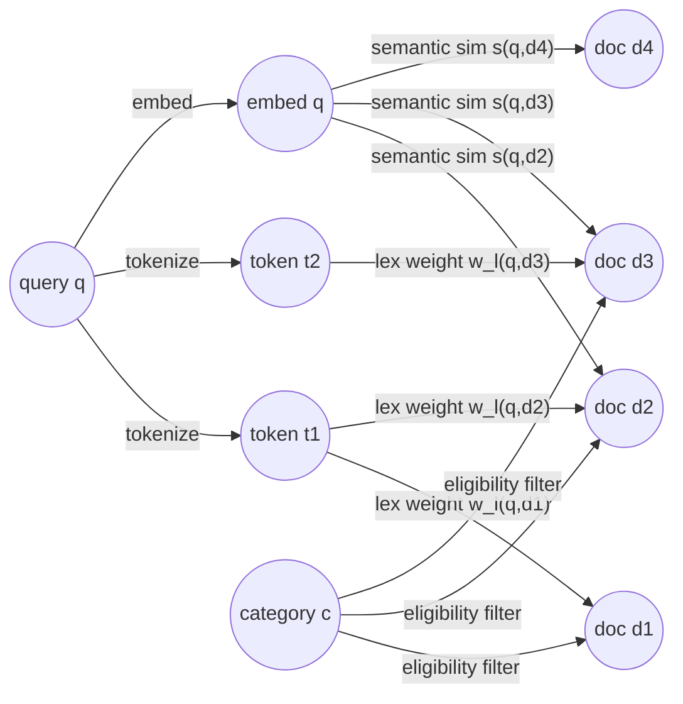

Graph rules:

- Keyword search ranks over the lexical subgraph `G_lex`.
- Vector search ranks over the semantic-neighborhood subgraph `G_vec`.
- Category filtering is an eligibility constraint, not a score boost.
- Hybrid candidates are `C = C_kw union C_vec`, after eligibility filters.
- De-duplication is graph vertex identity: the same document vertex must not appear twice.
- A missing retrieval channel removes edges from the graph; it must not silently turn into an empty result claim.

Candidate-set model:

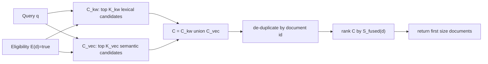

Failure in graph terms:

- Keyword-path failure means `C_kw` is unavailable, not empty.
- Vector-path failure means `C_vec` is unavailable, not empty.
- `C_kw = empty` is a valid result only when keyword retrieval succeeded and found no candidates.
- `C_vec = empty` is a valid result only when vector retrieval succeeded and found no candidates.
- Degraded hybrid search is a ranking over a strict subset of intended evidence.

Queue theory:

Search is a queueing network. Each request class consumes a different sequence of service stations.

Request classes:

- `R_kw`: keyword-only request.
- `R_vec`: vector-only request.
- `R_hyb`: hybrid request.
- `R_hit`: cache-hit request.

Each class has a different service demand vector. Capacity planning must model the mix, not just total request rate.

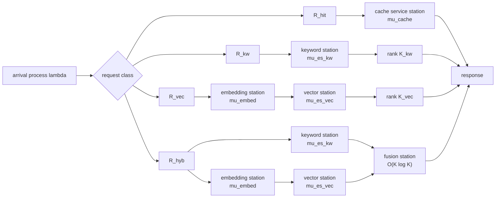

Queue requirements:

- Define service stations and concurrency bounds; do not rely on unbounded defaults.
- Measure queue wait time separately from service time.
- Liveness must not wait behind expensive search traffic.
- Readiness must stay bounded and should not run model inference.
- If any queue wait exceeds its configured deadline, reject with an overload or timeout error.
- Retrying work increases effective arrival rate. Retry policy must be included in capacity modeling.

Approximate request cost by search type:

| Search Type | Mandatory Stages | Time Cost Shape | Space Cost Shape |
| --- | --- | --- | --- |
| Keyword | validate + cache + ES keyword + serialize | `T_kw = T_api + T_cache + T_es_kw + T_ser` | `O(K_kw)` |
| Vector | validate + cache + embed + ES vector + serialize | `T_vec = T_api + T_cache + T_embed + T_es_vec + T_ser` | `O(D + K_vec)` |
| Hybrid | validate + cache + keyword + embed + vector + fusion + serialize | `T_hyb = T_api + T_cache + max(T_es_kw, T_embed + T_es_vec) + T_fusion + T_ser` if parallelized | `O(D + K_kw + K_vec)` |

Information theory:

Search is signal recovery under uncertainty. Keyword and vector retrieval expose different channels with different information loss.

- Keyword channel preserves lexical tokens and exact terms.
- Vector channel compresses text into `D` dimensions and loses exact lexical detail.
- Category filters add structured information and reduce entropy in the candidate set.
- Hybrid fusion combines two noisy rankings, not two directly comparable scores.
- Degradation metadata reduces operator uncertainty after partial failure.

Formal framing:

- Let `Q` be the normalized query.
- Let `D_doc` be an article document.
- Keyword retrieval estimates lexical relevance `P(relevant | tokens(Q), tokens(D_doc))`.
- Vector retrieval estimates semantic proximity `sim(embed(Q), embed(D_doc))`.
- Hybrid fusion should rank by evidence from both channels without pretending their raw scores share units.

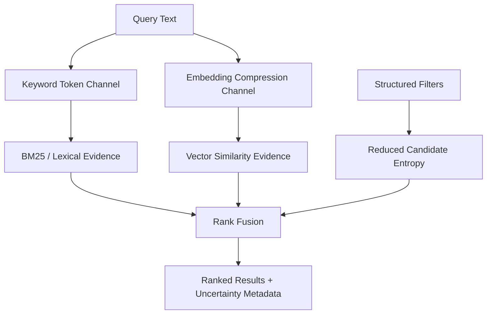

Information requirements:

- Treat BM25 and vector similarity as different units.
- Prefer rank-based fusion until relevance evaluation supports another method.
- Preserve component scores while the system is being evaluated.
- Track zero-result rates by executed search type.
- Track degraded responses because they change confidence in result quality.

Game theory:

Clients, attackers, operators, and the service have different incentives. Policy should reward normal use and make abuse expensive or unproductive.

Players:

- Normal client: wants relevant results with low latency.
- Abusive client: wants to consume disproportionate resources.
- Operator: wants stability, observability, and rollback control.
- Service: enforces policy through validation, rate limits, and backpressure.

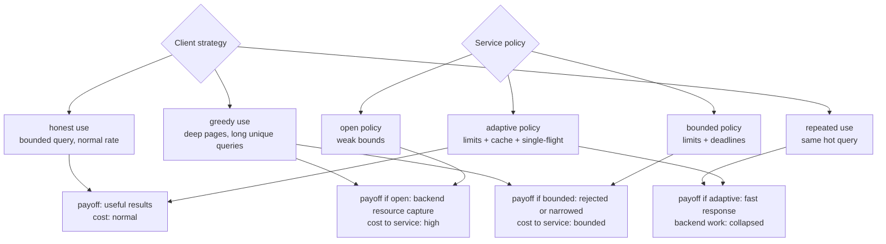

Game-theory requirements:

- Make expensive strategies less rewarding: bound query length, page size, vector candidate pool, and concurrency.
- Make repeated identical work cheap for the service: cache and single-flight.
- Make honest client behavior predictable: stable contracts and clear errors.
- Avoid policies that punish normal users first under attack.
- Rate limits should use API-key identity before IP identity when keys exist.

Auction theory:

Search ranking behaves like allocation under scarce attention. The top result positions are scarce slots. Retrieval paths submit candidate documents with evidence. Fusion is the allocation mechanism.

- Candidate documents "bid" for rank using evidence signals.
- Keyword and vector systems produce bids in different currencies.
- Raw-score fusion is invalid currency conversion unless calibrated.
- RRF is a simple mechanism that allocates rank based on relative position rather than raw score magnitude.
- Tie-breaking rules are part of the allocation mechanism and must be deterministic.

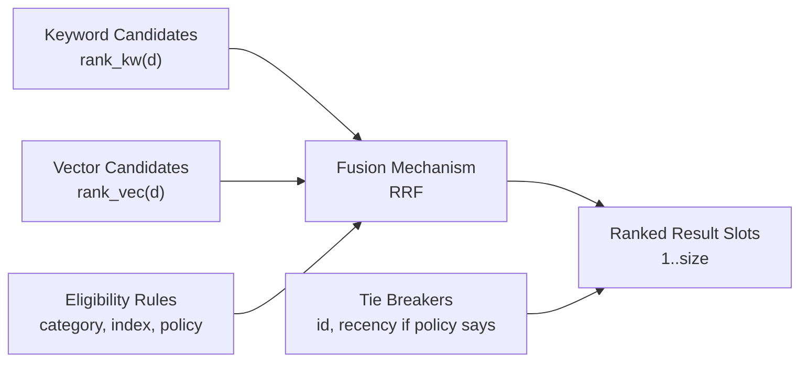

RRF expression:

```text
S_fused(d) = sum over retrieval paths p of 1 / (k + rank_p(d))
```

Where:

- `d` is a candidate document.
- `p` is a retrieval path, such as keyword or vector.
- `rank_p(d)` is the 1-based rank of document `d` in path `p`.
- `k` is the RRF smoothing constant.
- Missing documents in a path contribute `0`.

Auction-theory requirements:

- Define eligibility before ranking: filters determine which documents can compete.
- Define deterministic tie-breaking.
- Do not let one retrieval path dominate because its raw score scale is larger.
- Version the ranking mechanism because changing it changes allocation.
- Use relevance evaluation to decide whether the mechanism is producing acceptable allocations.

#### Qualities To Optimize For

Optimize quality attributes against explicit metrics and constraints.

| Quality | Direction | Measured By | Hard Constraint | Conflict Rule |
| --- | --- | --- | --- | --- |
| Correctness | Maximize | Contract tests, ranking tests, dependency-failure tests | Returned score must equal ranking score. | Correctness beats latency and implementation convenience. |
| Relevance | Maximize with evidence | Golden queries, NDCG/MRR/precision/recall once datasets exist | No arbitrary weight changes without evaluation data. | Relevance changes must be versioned if they alter ranking semantics. |
| Performance | Target, then minimize tail | P50/P95/P99 latency by search type, dependency latency, serialization time | No unbounded expensive paths. | First bound work, then tune; do not hide slow paths with retries. |
| Availability | Maximize for supported modes | Uptime, readiness success rate, dependency availability, successful request rate | Mandatory dependency failure must make readiness fail. | Prefer clear unavailable errors over false healthy states. |
| Reliability | Maximize | Error rate by class, timeout rate, retry exhaustion, degraded response rate | Dependency failures must not be returned as empty successful results. | Reliable failure semantics beat optimistic partial success. |
| Resilience | Maximize | Recovery time, circuit-open duration if used, overload rejection rate | Overload must be bounded. | Reject early rather than allowing queue collapse. |
| Scalability | Maximize only after baseline | Throughput by worker/replica, ES CPU/heap, Redis latency, model memory | Scale claims require measured corpus and traffic tiers. | Scale horizontally only after per-node bottlenecks are understood. |
| Security | Maximize | Auth failures, key misuse events, redaction tests, protected-route tests | Production convenience does not override credential or route safety. | Fail closed for auth and protected internal surfaces. |
| Privacy | Maximize | Log/trace scans, redaction tests, query retention checks | Raw queries are not telemetry labels by default. | Debuggability cannot require leaking sensitive query text. |
| Operability | Maximize | Time to diagnose, runbook coverage, alert precision, dashboard coverage | Operators must distinguish validation, dependency, overload, and bug failures. | Add operational visibility before adding hidden automation. |
| Observability | Maximize useful signal, minimize noise | Metric cardinality, trace coverage, log structure, sampling behavior | No high-cardinality user-controlled labels. | Prefer low-cardinality structured signals over verbose logs. |
| Maintainability | Maximize | Module coupling, test isolation, type coverage, change blast radius | Search services must not depend on FastAPI globals. | Clear boundaries beat premature abstraction. |
| Testability | Maximize | Unit/property/fuzz/contract/integration coverage by behavior | Ranking and cache-key logic must be testable without services running. | Untested behavior is not accepted as production behavior. |
| Cost | Minimize subject to correctness | ES resource use, embedding CPU/memory, cache memory, telemetry volume | Do not brute-force vectors when indexed kNN is available. | Spend resources where they improve correctness, relevance, or reliability. |
| Simplicity | Maximize subject to explicit guarantees | Number of moving parts, operational steps, config surface | Infrastructure must have a measured or clearly anticipated role. | Remove features that cannot explain their operational value. |

Optimization rules:

- A quality without a metric is an intention, not a requirement.
- A metric without a threshold is a baseline task, not an SLO.
- A threshold without a rollback or mitigation path is not operationally useful.
- If two qualities conflict, prefer the one tied to an invariant or explicit guarantee.
- Performance tuning cannot change response semantics.
- Availability tuning cannot hide dependency failure.
- Cost reduction cannot remove safety checks.
- Observability cannot leak secrets or sensitive query text.

#### Scale

Scale is not yet quantified.

Before claiming scale, measure:

- Corpus size tiers.
- Query mix.
- Candidate pool size.
- kNN `num_candidates`.
- Embedding concurrency.
- Cache hit rate.
- ES heap and CPU.
- Redis latency.
- API worker count.

### 6.6 Core Entities

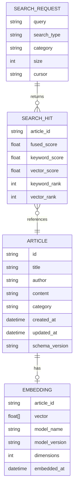

### 6.7 Structure

#### APIs

`POST /v2/search`

Headers:

- `Content-Type: application/json`
- `X-API-Key: <key>` for protected environments
- `X-Request-ID: <optional-client-request-id>`

Status codes:

- `200`: Successful complete or explicitly degraded search.
- `400` or `422`: Invalid request, depending on framework-level vs application-level validation policy.
- `401`: Missing or invalid API key.
- `429`: Rate limit exceeded.
- `503`: Mandatory dependency unavailable or service not ready.
- `504`: Dependency deadline exceeded if timeout policy maps deadlines separately.

Request:

```json
{
  "query": "machine learning in healthcare",
  "size": 10,
  "cursor": null,
  "category": "Health",
  "search_type": "auto"
}
```

Response:

```json
{
  "results": [],
  "pagination": {
    "size": 10,
    "next_cursor": null
  },
  "search": {
    "requested_type": "auto",
    "executed_type": "hybrid",
    "ranking_strategy": "rrf",
    "degraded": false,
    "warnings": []
  },
  "meta": {
    "request_id": "req_...",
    "took_ms": 0
  }
}
```

Error response:

```json
{
  "error": {
    "code": "DEPENDENCY_UNAVAILABLE",
    "message": "Search dependency is unavailable.",
    "request_id": "req_..."
  }
}
```

### 6.8 Design To Satisfy Functional Requirements

#### High-Level Functional Diagram

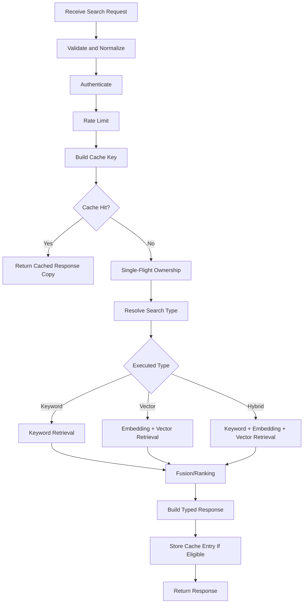

#### Low-Level Lifecycle Model

Lifecycle costs:

- `TC` means time cost.
- `SC` means space cost.

| Stage | TC | SC | Risk | Mitigation |
| --- | --- | --- | --- | --- |
| Request validation | O(length of request) | O(1) | Oversized input | Max query/body length. |
| Cache key build | O(length of normalized inputs) | O(length of key material) | Ambiguous keys | Stable structured serialization. |
| Cache lookup | O(1) expected local or Redis command latency | Payload size | Corrupt or stale cache | Versioned namespace, decode handling. |
| Embedding | Model-dependent | Model memory + vector | CPU/thread pressure | Separate bounded concurrency. |
| Keyword retrieval | ES-dependent | Candidate set | Slow query/fuzziness cost | Timeouts, query tuning. |
| Vector retrieval | ES kNN-dependent | Candidate set | Expensive high candidate pool | Bounded candidate pool and `num_candidates`. |
| Fusion | O(k log k) for candidate count k | O(k) | Incomparable scores | RRF and component metadata. |
| Response serialization | O(response size) | Response size | Large payloads | Snippets/source filtering. |

Data structures:

- Cache keys use structured canonical serialization before hashing.
- Single-flight uses per-key ownership, not one global blocking lock.
- Fusion uses maps keyed by article ID plus stable tie-breakers.
- Pagination state uses cursor payloads or bounded shallow offsets.

#### State Machine

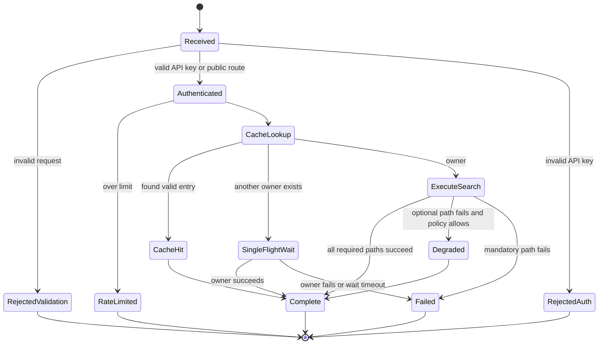

#### Failure-Aware Retrieval

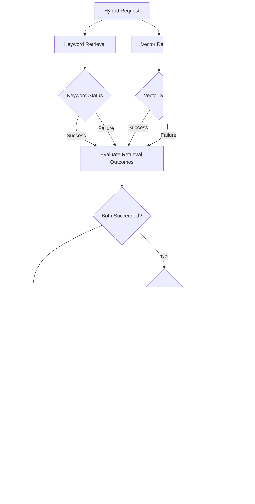

### 6.9 Deep Dives To Satisfy NFRs

#### Production-Aware Diagram

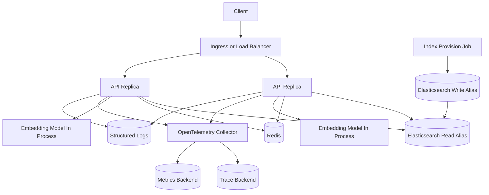

#### Trade-Off Analysis

Trade-offs are evaluated against NFRs, not implementation preference.

| NFR Tension | Optimize For | Trade-Off Accepted | Measurement Needed | Revisit When |
| --- | --- | --- | --- | --- |
| Correctness vs performance | Correctness | Ranking may spend extra time preserving score semantics and component evidence. | Ranking latency, fusion latency, contract failures | Fusion cost dominates latency after retrieval is optimized. |
| Relevance vs explainability | Explainability until relevance data exists | Use RRF and component scores instead of opaque learned ranking. | Golden-query quality metrics, operator/debug usefulness | Evaluation data proves a more complex ranker is worth it. |
| Availability vs consistency | Clear consistency boundary | Search remains eventually consistent; readiness fails on incompatible indices. | Refresh delay, stale-result rate, index-validation failures | Product requires read-after-write search guarantees. |
| Resilience vs simplicity | Bounded failure behavior | Add deadlines, backpressure, and explicit degradation even if code is more complex. | Timeout rate, overload rejection rate, degraded response rate | Complexity exceeds operational value or a simpler dependency handles it. |
| Performance vs cost | Bounded efficient retrieval | Use indexed kNN and bounded candidate pools rather than brute-force scoring. | ES CPU/heap, vector latency, candidate-pool quality | Relevance requires larger pools or different retrieval strategy. |
| Availability vs security | Security | Protected endpoints fail closed even if that reduces availability for misconfigured clients. | Auth failure rate, support/debug events | Operational need requires a controlled break-glass path. |
| Observability vs privacy | Privacy | Avoid raw query labels/logs even if debugging takes more correlation work. | Redaction test results, diagnostic sufficiency | A controlled debug mode is needed with explicit access policy. |
| Scalability vs maintainability | Maintainability until scale is measured | Keep modular monolith instead of splitting services prematurely. | Per-component resource saturation, deployment bottlenecks | Search, indexing, or embedding need independent scaling. |
| Operability vs feature velocity | Operability | Require health, error, and contract behavior before adding more search features. | Runbook coverage, alert quality, incident/debug time | Operational gates become disproportionate to project risk. |
| Cache efficiency vs correctness | Correctness | Cache keys include ranking/index/model versions, increasing key cardinality. | Cache hit rate, stale-cache incidents, memory usage | Hit rate is too low to justify cache complexity. |

#### Observability

Required signals:

- Search request count.
- Search latency by executed search type.
- Result count.
- Degraded response count.
- Cache hit/miss.
- Cache wait/single-flight count.
- Embedding latency.
- Elasticsearch keyword latency.
- Elasticsearch vector latency.
- Redis rate-limit latency.
- Rate-limit denies.
- Readiness failures.

Forbidden by default:

- Raw query metric labels.
- Raw API keys.
- Raw credentials.
- High-cardinality user-controlled attributes.

#### Auditability Policy

Audit events:

- Authentication failure.
- Rate-limit denial.
- Config validation failure.
- Index validation failure.
- Alias swap.
- Seed/provision job result.
- Degraded search response.

Audit events should include:

- Request ID where applicable.
- API key ID if available, not raw key.
- Route.
- Error code.
- Dependency name.
- Timestamp.

#### Economic Value

Economic value is not "use more infrastructure."

Value comes from:

- Avoiding wasted Elasticsearch work through correct cache/single-flight behavior.
- Avoiding brute-force vector scoring when indexed retrieval is available.
- Avoiding operational incidents through startup/index validation.
- Avoiding debugging cost through typed errors and observable degradation.
- Avoiding rewrite cost through modular boundaries.

#### Criteria For Production Grade

Production-grade criteria:

- Config is validated at startup.
- Secrets are not committed.
- Search response contract is stable and tested.
- Error response contract is stable and tested.
- Index compatibility is validated before readiness.
- Dependency failure behavior is tested.
- Rate limiting identity is correct behind deployment topology.
- Metrics/logs/traces answer operational questions.
- Load tests include latency and error analysis.
- Runbooks exist for known failure modes.
- Rollback path is documented and tested.

### 6.10 Operational Use

#### Controls

Runtime controls:

- Enable/disable response cache.
- Enable/disable partial degraded results.
- Select ranking strategy.
- Configure candidate pool size.
- Configure vector `num_candidates`.
- Configure max query length.
- Configure max page size.
- Configure API-key rate limits.
- Configure Redis fallback policy.

Safety controls:

- Startup config validation.
- Index compatibility validation.
- Readiness failure on mandatory dependency failure.
- Cache namespace versioning.
- Alias-based index rollout.
- Bounded concurrency.
- Request timeouts.

#### Rollout Plan


Phase 1: Local dev

- View: logs, local health endpoints, local ES/Redis containers.
- Controls: cache off/on, seed size, debug docs.
- Safety: no production keys, no public ports beyond local.
- Exit: unit/property/fuzz tests pass locally.

Phase 2: Integration test

- View: API, Elasticsearch, Redis integration results.
- Controls: seeded corpus size, dependency outage tests.
- Safety: isolated test network and disposable volumes.
- Exit: contract and integration tests pass.

Phase 3: Staging

- View: dashboards, traces, readiness, dependency latency.
- Controls: feature flags, cache namespace, index aliases.
- Safety: production-like config validation, protected internals.
- Exit: smoke tests, failure tests, and baseline load tests pass.

Phase 4: Canary

- View: v1/v2 comparison, error rate, latency, degraded count.
- Controls: route small traffic slice to v2.
- Safety: instant route rollback.
- Exit: no contract regressions, acceptable latency/error delta.

Phase 5: Gradual rollout

- View: increasing traffic share metrics.
- Controls: traffic percentage, feature flags.
- Safety: pause/rollback threshold.
- Exit: stable at agreed traffic level.

Phase 6: Full deploy

- View: full production-style telemetry.
- Controls: rollback route, alias rollback, cache invalidation.
- Safety: runbook active.
- Exit: stable after defined observation window.

Phase 7: Post-deploy validation

- View: relevance checks, latency, cost, dependency health.
- Controls: ranking/candidate tuning.
- Safety: rollback and feature disable remain available.
- Exit: deployment review completed.

#### Risk Matrix

Risks are scoped by high-level design component so ownership is clear. General risks without a component owner are hard to test, monitor, or mitigate.

| HLD Component | Risk | Likelihood | Impact | Detection | Mitigation |
| --- | --- | --- | --- | --- | --- |
| API / Controller | Response contract drifts from documented schema. | Medium | High | Contract tests, OpenAPI snapshot tests | Typed response models and schema-versioned contract tests. |
| API / Controller | Validation accepts expensive or ambiguous requests. | Medium | High | Fuzz tests, validation metrics, 4xx distribution | Max query length, max page size, explicit validation errors. |
| Search Service | Returned score does not match ranking score. | Medium | High | Ranking unit tests, contract tests | Return fused score as primary score and preserve component scores. |
| Search Service | `auto` routing hides actual executed behavior. | Medium | Medium | Contract tests, search metadata checks | Return requested and executed search type. |
| Fusion / Ranking | Fusion strategy overweights one retrieval path. | Medium | High | Golden-query tests, component-score diagnostics | Use rank-based fusion until calibrated scoring is justified. |
| Elasticsearch Repository | Vector retrieval becomes too expensive. | Medium | High | ES latency, CPU, heap, timeout metrics | Native kNN, bounded `num_candidates`, candidate-pool tests. |
| Elasticsearch Repository | Partial shard/index errors are treated as no results. | Medium | High | Integration tests, dependency error metrics | Explicit error classification and degraded/failure response policy. |
| Indexing / Mappings | Index and embedding model versions mismatch. | Medium | High | Startup validation, readiness checks | Store model metadata and validate dimensions/version before ready. |
| Cache | Cache key misses behavior-affecting input. | Medium | High | Property tests, stale-result checks | Structured key builder with index/model/ranking versions. |
| Cache / Single-Flight | Owner failure or waiter cancellation leaks in-flight state. | Medium | Medium | Concurrency tests, in-flight gauge | Per-key ownership, cancellation handling, timeout cleanup. |
| Rate Limit | Redis fallback weakens production protection. | Medium | High | Config validation, readiness, fallback metric | Environment-specific fallback policy; production fail-closed where required. |
| Auth | API key comparison or storage is unsafe. | Medium | High | Security tests, code review, redaction tests | Constant-time comparison, key IDs/hashes, no raw key logging. |
| Observability | Raw query or credential leaks into telemetry. | Low | High | Redaction tests, log/trace scans | No raw query labels by default; structured redaction utilities. |
| Health / Lifecycle | Readiness passes while index is incompatible. | Medium | High | Startup/readiness integration tests | Mapping, alias, vector dimension, and model metadata validation. |
| Deployment / Rollout | Bad ranking/index change cannot be rolled back cleanly. | Medium | High | Rollout tests, alias audit events | Versioned APIs, alias swaps, cache namespace rotation. |
| Pagination | Hybrid pagination is inconsistent across retrieval paths. | Medium | Medium | Pagination property tests | Cursor or bounded shallow pagination after fusion. |

#### Economic Model

| Cost Driver | Direction | Measurement Needed | Control |
| --- | --- | --- | --- |
| Embedding inference | Increases with query volume and cache misses | Embedding latency and CPU/memory | Embedding cache, concurrency bounds |
| Vector retrieval | Increases with corpus size and candidate pool | ES latency, CPU, heap | kNN tuning, candidate bounds |
| Keyword retrieval | Increases with fuzziness and corpus size | ES query latency | Analyzer/boost tuning, timeout |
| Cache | Increases with response size and cardinality | Memory, hit rate, serialization latency | TTL, namespace, eligibility |
| Telemetry | Increases with traffic and span volume | Export latency, storage | Sampling and low-cardinality attributes |

#### Runbook Index

Minimum runbooks:

- `RUNBOOK-001`: Elasticsearch unavailable.
- `RUNBOOK-002`: Redis unavailable.
- `RUNBOOK-003`: Embedding model load failure.
- `RUNBOOK-004`: High search latency.
- `RUNBOOK-005`: High 5xx rate.
- `RUNBOOK-006`: Degraded responses increasing.
- `RUNBOOK-007`: Index validation failure.
- `RUNBOOK-008`: Bad deployment rollback.
- `RUNBOOK-009`: Cache stampede.
- `RUNBOOK-010`: Rate-limit spike.

#### Alerts

Initial alerts:

- Readiness failing for longer than deployment-defined threshold.
- 5xx rate above target.
- P95 latency above target.
- Elasticsearch latency above target.
- Degraded responses above target.
- Rate-limit denials above expected baseline.
- Index validation failure.
- Redis fallback active in production-like environment.

Thresholds are `TBD` until baseline measurement exists.
