# myflix v1: Quantified Production System Design Specification

**Status:** Proposed; implementation is blocked on workload validation and an approved delivery budget.  
**Primary region:** `europe-west2` (London).  
**Capacity objective:** 10,000 simultaneous playback sessions at peak. This is a target to prove, not a capacity claim.  
**Owner:** Single backend/platform engineer.

## Executive constraints

The system separates the control plane from the media data plane. Go APIs authorize playback and manage metadata; video bytes travel directly from Media CDN to clients and never through GKE.

The 10,000-stream target dominates the design and cost:

| Input | Baseline | Sensitivity |
|---|---:|---:|
| Simultaneous streams | 10,000 | 2,500-15,000 |
| Average delivered bitrate | 3 Mbps | 1.5-6 Mbps |
| Peak duration | 4 hours/day | 2-8 hours/day |
| API activity | 3 requests/user/minute | 1-6 |
| CDN cache hit ratio by bytes | 90% | 70-98% |

Baseline calculations:

```text
API request rate = 10,000 * 3 / 60 = 500 requests/second
Video throughput = 10,000 * 3 Mbps = 30 Gbps
Video transfer = 30 Gbps / 8 * 3,600 = 13.5 TB/peak-hour
Monthly peak-window transfer = 13.5 TB * 4 hours * 30 days = 1.62 PB/month
```

At a hypothetical CDN delivery price of $0.02-$0.08/GiB, 1.62 PB is approximately $32,000-$130,000/month before API, database, storage, observability, cache-fill, request, tax, or support charges. Pricing must be recalculated with the GCP calculator and contracted SKUs before approval. A $2,000/month total budget is incompatible with 10,000 simultaneous 3 Mbps streams for four hours daily.

---

## 1. Context

### Purpose

Build a secure video-on-demand platform that can authorize and deliver video to 10,000 simultaneous viewers, operate primarily on Google Cloud, and remain manageable by one engineer.

### Mission

Users can discover and play entitled content with low startup delay. Administrators can ingest, moderate, publish, restrict, and retire content safely. The platform produces sufficient telemetry and audit evidence to detect failures and recover without improvisation.

### Consequence of absence

The legacy Flask/VM deployment remains manually patched, difficult to scale, weakly observable, and dependent on single instances. Capacity and recovery claims remain untestable, and media delivery continues to be coupled to application infrastructure.

### Scope

- Web API for catalogue, authentication/session integration, playback authorization, watch progress, and administration.
- HLS video-on-demand delivery through Media CDN backed by private Cloud Storage.
- Direct resumable administrative uploads to a quarantine bucket.
- Validation and transcoding workflow.
- Subscription entitlement consumption; payment-provider integration is a boundary dependency.
- PostgreSQL transactional storage, Pub/Sub event delivery, audit records, observability, CI/CD, infrastructure as code, backup, and recovery.
- UK deployment with an explicit path to an EU secondary region.

### Non-goals

- User-facing web/mobile applications.
- Live streaming, offline playback, DRM, 4K/HDR, multi-tenancy, social features, or custom CDN implementation.
- Building a payment processor or storing card data.
- Building an ML recommendation engine for v1.
- Active-active multi-region service at launch.
- A service mesh or independently deployed service for every domain module.

## 2. Problem statement

### User problem

Users need reliable playback, correct entitlement enforcement, resumable watch progress, and predictable errors. Playback must not depend on a Go service proxying video bytes.

### Business problem

The platform must establish whether 10,000 concurrent streams are economically viable, safely publish licensed content, and support growth without manual VM administration.

### Technical problem

The legacy system lacks measured capacity, automated recovery, repeatable infrastructure, bounded database concurrency, a production media pipeline, and usable service-level indicators.

### Adversarial problem

Assume credential stuffing, token theft, URL sharing, scraping, denial-of-wallet attacks, malicious media files, oversized payloads, stale permissions, replayed events, operator deletion, leaked credentials, dependency compromise, zonal failure, queue backlog, and traffic several times forecast. Security controls must also limit cost amplification, not only unauthorized access.

## 3. Constraints

### Economic

- Media delivery is a separately approved variable budget; no fixed sub-$2,000 target is asserted for 10,000 streams.
- Initial non-media infrastructure target: **$1,500-$3,500/month**, subject to measured sizing.
- Billing alerts: 50%, 75%, 90%, and 100% of monthly budget; anomaly alerts enabled.
- One engineer owns implementation and operations. Complexity has a direct personnel cost.

### Operational

- One primary engineer; no claimed 24/7 human response without a funded rotation.
- Target routine maintenance: four hours/week after stabilization.
- Managed GCP services are preferred over self-hosted databases, brokers, dashboards, and ingress controllers.

### Technical

- Go 1.24 or current supported stable version at implementation time.
- GKE Autopilot for replicated APIs and long-running consumers.
- Cloud Run Jobs or isolated Kubernetes Jobs for bounded media work, selected after an FFmpeg benchmark.
- Cloud SQL for PostgreSQL, private GCS buckets, Media CDN, Pub/Sub, Secret Manager, Cloud KMS, Cloud Armor, and Workload Identity Federation.
- Existing React/Next.js clients consume versioned JSON APIs and HLS manifests.
- Infrastructure is declared with Terraform/OpenTofu; no console-only production resources.

### Environmental

- Primary users are in the UK; primary compute and transactional data are in London.
- Personal data remains in approved UK/EU locations.
- GDPR workflows include access, export, correction, erasure, retention, and consent evidence.

### Security

- No service-account keys in workloads.
- Private origins; public object access prevention enabled.
- TLS externally and to managed dependencies; Kubernetes NetworkPolicy limits east-west traffic.
- Admin access requires IAP identity **and** application-level authorization.
- Password authentication, if retained, uses a reviewed adaptive password hash and breached-password controls. Identity Platform is evaluated before custom authentication is approved.
- Secrets are stored in Secret Manager and rotated under documented procedures.

### Time

- Discovery/capacity prototype: 2-3 weeks.
- Production core: 8-12 weeks.
- Hardening and 10,000-session qualification: 4-8 additional weeks.
- Dates are estimates, not commitments, for one engineer.

## 4. Knowns, unknowns, and assumptions

### Known facts

- GCP and GKE are required.
- Peak objective is 10,000 simultaneous playback sessions.
- The product is video-on-demand, 1080p maximum for v1.
- PostgreSQL is the source of truth for users, catalogue, entitlements, and workflow state.
- Video files are stored in GCS and served through a CDN.

### Unknowns requiring measurement

- Average/p95 bitrate, session duration, abandonment rate, device mix, and geographic mix.
- Catalogue size, source file size, upload rate, and rendition ladder.
- Peak duration, catalogue popularity distribution, and cache-hit ratio by bytes.
- Browse/search QPS, progress heartbeat interval, and login rate.
- CDN commercial rate, licensed-content protection requirements, and acceptable fraud rate.
- Exact RTO/RPO business value and staffing for incident response.

### Risks from unknowns

Bandwidth cost may exceed the product's revenue. A long-tail catalogue can lower cache efficiency. Per-segment authorization can overload APIs. Poor rendition choices can double egress. Unmeasured database access can exhaust connections before CPU scales.

### Assumptions

- Baseline average bitrate is 3 Mbps and the peak lasts four hours/day.
- HLS segments are authorized at Media CDN; APIs are not called per segment.
- 500 API requests/second is the baseline and 1,500 requests/second is the qualification burst.
- PostgreSQL initially handles transactional reads/writes without a read replica; replicas are added from evidence.
- Recommendations are simple popularity/editorial queries in v1.

## 5. Scale and load profile

| Metric | Launch baseline | Qualification target |
|---|---:|---:|
| Registered users | 100,000 | 250,000 |
| Monthly active users | 50,000 | 200,000 |
| Simultaneous playback sessions | 2,500 expected | 10,000 peak |
| Control-plane API | 500 RPS | 1,500 RPS for 30 minutes |
| Playback authorization | 167 RPS at 1 start/minute | 500 RPS burst |
| Watch-progress writes | 333 RPS at 30-second heartbeat | 1,000 RPS burst |
| Admin traffic | <5 RPS | 20 RPS |
| API read/write ratio | 80/20 | measured per endpoint |
| Average/p95 API payload | 5/50 KiB | 256 KiB hard response target |
| Video throughput | 7.5 Gbps expected | 30 Gbps target at 3 Mbps |
| Source video storage | 10 TB initial | 100 TB planning horizon |
| Metadata/event growth | measured in prototype | 20%/month planning case |

Load tests model ramp-up, steady peak, flash crowd, dependency degradation, and recovery. CDN throughput and API throughput are tested separately and end to end.

## 6. Functional requirements

### FR-1: Authenticate and manage sessions

- **Description:** Register/login or federate identity, issue short-lived access tokens, rotate refresh tokens, revoke sessions, and lock abusive attempts.
- **Positive:** Valid identity receives a session and can refresh it once per rotation.
- **Negative:** Invalid credentials, replayed refresh tokens, disabled users, and malformed tokens are rejected.
- **Failure:** Authentication dependency failure returns `503`; existing cryptographically valid access tokens continue only until expiry according to policy.

### FR-2: Browse catalogue

- **Description:** List, filter, search, and retrieve published video metadata with cursor pagination.
- **Positive:** Published eligible content returns within the latency SLO.
- **Negative:** Deleted, unpublished, or unauthorized metadata is not disclosed.
- **Failure:** Safe cached public metadata may be returned with a staleness marker; personalized results fail explicitly.

### FR-3: Authorize playback

- **Description:** Strongly evaluate user state, subscription entitlement, video state, and restrictions, then issue a path-scoped Media CDN token.
- **Positive:** An entitled user receives a token usable for the intended rendition paths and playback duration.
- **Negative:** Expired subscription, suspended user, deleted/restricted video, replay outside scope, or invalid identity returns `403`.
- **Failure:** Fail closed. No new token is issued when authoritative entitlement cannot be established.

### FR-4: Record watch progress

- **Description:** Accept monotonic progress updates using a session/event identifier.
- **Positive:** Duplicate or reordered delivery converges without moving progress backwards, except an explicit restart.
- **Negative:** Impossible timestamps, unknown videos, oversized batches, and cross-user writes are rejected.
- **Failure:** Client retries with idempotency key; accepted events are eventually reflected within 60 seconds.

### FR-5: Ingest and publish video

- **Description:** An authorized admin creates an upload session, uploads directly to quarantine GCS, validates/transcodes it, reviews metadata, and publishes it.
- **Positive:** Valid input produces playable HLS renditions and transitions to `ready`, then `published` after approval.
- **Negative:** Oversized, corrupt, unsupported, or policy-violating media never reaches the delivery bucket.
- **Failure:** Job retries boundedly, then transitions to `failed` with diagnostics and cleanup instructions.

### FR-6: Administer content

- **Description:** Admins edit, restrict, unpublish, restore, and schedule deletion with optimistic concurrency.
- **Positive:** Authorized changes create immutable audit events.
- **Negative:** Missing role, stale version, invalid transition, or conflicting update is rejected.
- **Failure:** Transaction rolls back; storage cleanup is asynchronous and idempotent.

### FR-7: Consume subscription state

- **Description:** Verify signed payment webhooks, deduplicate events, and update entitlement state.
- **Positive:** A valid ordered or reordered event converges to the provider's authoritative state.
- **Negative:** Invalid signatures, unknown accounts, duplicate event IDs, and impossible transitions are quarantined or rejected.
- **Failure:** Return retryable failure before durable receipt; dead-letter after bounded attempts and alert.

### FR-8: Export and erase personal data

- **Description:** Users can request export and erasure subject to legal retention.
- **Positive:** Export is complete and erasure is traceable within the declared deadline.
- **Negative:** One user cannot request another user's data.
- **Failure:** Workflow remains resumable and reports partial completion to operators.

## 7. Invariants

1. Unauthorized playback authorization never succeeds; uncertainty fails closed.
2. Video bytes never transit application pods in normal operation.
3. A published video references a validated manifest and complete rendition set.
4. State transitions occur through transactional compare-and-set updates.
5. Event handlers are idempotent and tolerate duplicate, delayed, and reordered events.
6. Progress does not regress without an explicit user action.
7. Admin mutations produce immutable audit evidence with actor and request ID.
8. GCS delivery objects are not publicly readable from the origin.
9. Workloads use federated identity, never static GCP service-account keys.
10. Database connections remain below the configured global safety limit.

## 8. Guarantees

- PostgreSQL commits provide transactional durability within Cloud SQL's configured service characteristics.
- Pub/Sub consumers provide at-least-once processing; exactly-once business effects are implemented with idempotency records.
- Playback authorization and subscription enforcement are strongly consistent at token issuance.
- Watch progress is eventually consistent within 60 seconds at p99 under normal operation.
- Audit events for successful admin mutations are committed in the same transaction via an outbox record.
- No guarantee of uninterrupted playback is made after CDN, ISP, device, or regional failure.

## 9. Consistency model

| Data | Model | Staleness/conflict rule |
|---|---|---|
| User status, entitlement, video publication state | Strong at token issuance | No stale allow decision |
| Admin metadata update | Strong with version column | `409` on stale version |
| Watch progress | Eventual | Maximum valid progress per playback attempt; explicit restart overrides |
| View counts/popularity | Eventual | Up to 15 minutes; recomputable |
| Catalogue cache | Eventual | Up to 60 seconds; purge on unpublish |
| Audit projection | Eventual from transactional outbox | Source outbox is authoritative |

## 10. Non-functional requirements

| Concern | Objective and target | Measurement | Degradation |
|---|---|---|---|
| Availability | Playback authorization 99.9%; catalogue 99.9%; admin 99.5% monthly | Good events / valid events | Catalogue may use safe cache; authorization fails closed |
| Reliability | <0.1% unexpected 5xx at qualified load | Per-route metrics | Shed optional traffic before critical traffic |
| Scalability | 10,000 streams and 1,500 API RPS qualification | Reproducible load report | Rate limit and admission control |
| Performance | API p50 <50 ms, p95 <150 ms, p99 <400 ms excluding client/CDN transfer | Server traces at load | Disable expensive optional enrichment |
| Startup experience | p95 playback start <2 seconds on defined UK test networks | Real-user monitoring | Lower initial rendition |
| Security | No known critical/high exploitable finding at launch | CI scans and independent review | Kill switches and credential rotation |
| Durability | RPO <=5 minutes for transactional data; source media protected by versioning/retention | Restore tests | Pause publishing if durability controls fail |
| Maintainability | One-command local stack; automated deploy/rollback; documented ownership | Change lead time and operator hours | Freeze features when operational budget exceeded |
| Cost | Per-viewer-hour and per-TB unit economics visible daily | Billing export dashboard | Cap uploads/quality or traffic by business policy |
| Auditability | 100% successful admin mutations attributable | Reconciliation job | Block admin mutation if audit transaction cannot commit |
| Observability | 100% request metrics; sampled traces; bounded logs | Coverage tests | Increase sampling during incidents |
| Operability | Rollback <10 minutes; common runbooks exercised quarterly | Drills | Read-only/admin-disabled modes |

## 11. Success conditions

- **User:** p95 playback start below two seconds on the agreed test profile; playback error rate below 1%; resume position converges within 60 seconds.
- **Business:** measured gross margin remains positive after CDN delivery cost; conversion and watch-time targets are defined outside architecture.
- **Operational:** three consecutive production deployments without manual resource edits; rollback and backup restore demonstrated.
- **Reliability:** 30-day SLOs met and error-budget policy enforced.
- **Security:** threat review complete; no unresolved critical/high exploitable findings; origin bypass test fails.
- **Recovery:** Cloud SQL failover test and regional rebuild exercise produce measured RTO/RPO. Targets are accepted only after evidence.

## 12. Core entities

| Entity | Owner | Lifecycle | Relationships/trust boundary |
|---|---|---|---|
| User | User/system | pending, active, suspended, erased | External identity mapped to internal ID |
| Session | User | active, rotated, revoked, expired | Secret-bearing; untrusted client |
| Subscription | Billing domain | free, trial, active, grace, expired, cancelled | Provider events are untrusted until verified |
| Video | Content admin | draft, uploading, validating, transcoding, ready, published, restricted, unpublished, deleting, deleted, failed | Metadata is internal; publication exposes selected fields |
| MediaAsset | System | quarantined, validated, processing, available, retired | GCS object and checksums |
| PlaybackGrant | System | issued, expired/revoked-by-policy | Short-lived capability at external edge |
| WatchSession | User | started, active, completed, abandoned | Client input is untrusted |
| AdminAction | System | append-only, archived | Immutable audit evidence |
| OutboxEvent | System | pending, published, dead-lettered | Internal delivery boundary |

## 13. State

- **Persistent:** users, sessions/refresh-token families, subscriptions, videos, assets, restrictions, watch summaries, idempotency keys, workflow jobs, audit/outbox records in PostgreSQL; media in GCS.
- **Ephemeral:** request context, local bounded caches, in-flight jobs, rate-limit counters.
- **Derived:** popularity, view counts, recommendations, operational dashboards.
- **Cached:** public catalogue and short-lived deny/allow inputs only where invalidation and maximum staleness are explicit. Redis is introduced only after load evidence.

## 14. APIs

External `/api/v1` resources:

```text
POST   /sessions
POST   /sessions/refresh
DELETE /sessions/{id}
GET    /videos?cursor=&limit=&query=
GET    /videos/{id}
POST   /videos/{id}/playback-grants
PUT    /watch-sessions/{id}/progress
POST   /privacy/exports
POST   /privacy/erasures
```

Administrative resources, protected by IAP and application authorization:

```text
POST   /admin/v1/videos
POST   /admin/v1/videos/{id}/upload-session
PATCH  /admin/v1/videos/{id}
POST   /admin/v1/videos/{id}:publish
POST   /admin/v1/videos/{id}:unpublish
DELETE /admin/v1/videos/{id}
GET    /admin/v1/jobs/{id}
```

- **Error model:** RFC 9457 problem details with stable code, safe message, request ID, and field violations.
- **Idempotency:** required for upload creation, webhook receipt, progress updates, publish/unpublish, and deletion. Keys are scoped to actor+operation and retained for at least 24 hours.
- **Versioning:** path major versions; additive changes are compatible; breaking versions have usage telemetry and an announced sunset.
- **Limits:** 1 MiB normal request body, 100 results/page, bounded query complexity. Media uploads bypass the API.
- Internal module calls are in-process. Pub/Sub is the asynchronous interface. No internal RPC service exists until justified by independent scaling or ownership.

## 15. Events

Versioned event envelopes contain event ID, type, schema version, aggregate ID/version, occurred time, trace/request ID, producer, and payload.

- **Inputs:** payment webhook received, GCS upload finalized, privacy request, operator command.
- **Outputs:** `video.uploaded`, `video.validated`, `video.transcode_completed`, `video.published`, `video.unpublished`, `playback.started`, `watch.progressed`, `subscription.changed`, `user.erasure_requested`.
- **Side effects:** jobs scheduled, delivery objects copied, CDN cache purged, projections updated, alerts emitted.
- No sensitive token, password, full email, or signed URL is placed in an event.

## 16. Data flows

### Ingestion

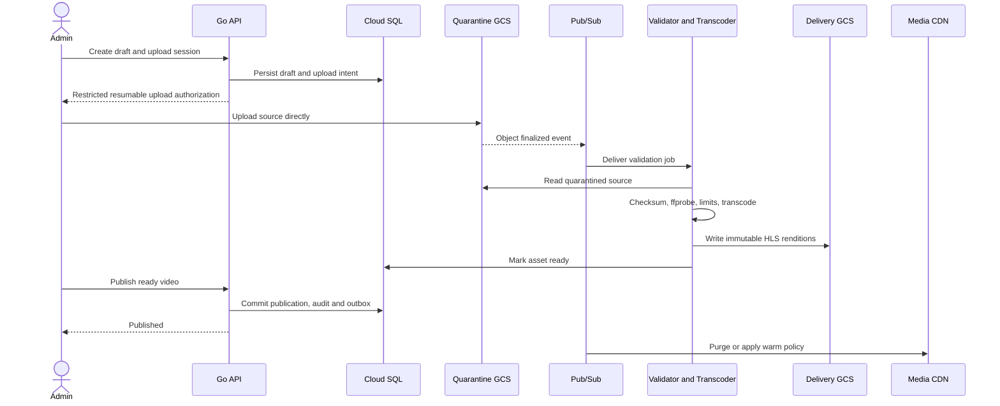

### Playback

```mermaid
sequenceDiagram
    actor Client
    participant API as Go API
    participant DB as Cloud SQL
    participant CDN as Media CDN
    participant GCS as Private delivery GCS
    participant Events as Progress ingestion

    Client->>API: Request playback grant
    API->>DB: Check user, entitlement, publication and restrictions
    alt Access allowed
        DB-->>API: Authoritative allow
        API-->>Client: Path-scoped, duration-bounded CDN token
        Client->>CDN: Request HLS manifest and segments
        CDN->>CDN: Validate token at edge
        alt Cache hit
            CDN-->>Client: Cached media bytes
        else Cache miss
            CDN->>GCS: Fetch private origin object
            GCS-->>CDN: Media object
            CDN-->>Client: Media bytes
        end
        Client->>Events: Idempotent bounded progress update
    else Access denied or uncertain
        API-->>Client: 403 or 503; no grant
    end
```

### Recovery and audit

Cloud SQL HA reconnects on the same endpoint after zonal failover; applications shed load and retry eligible operations with jitter. Regional recovery is infrastructure recreation plus database/object recovery, not automatic. Admin mutation, audit row, and outbox row commit atomically; publishers deliver outbox events asynchronously.

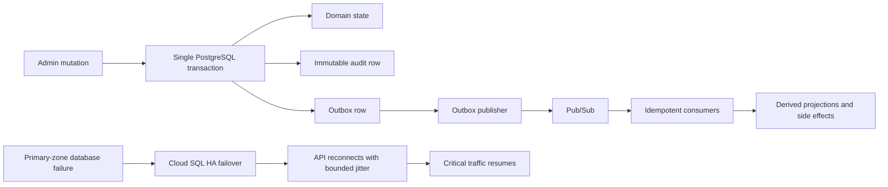

## 17. State machines

### Video

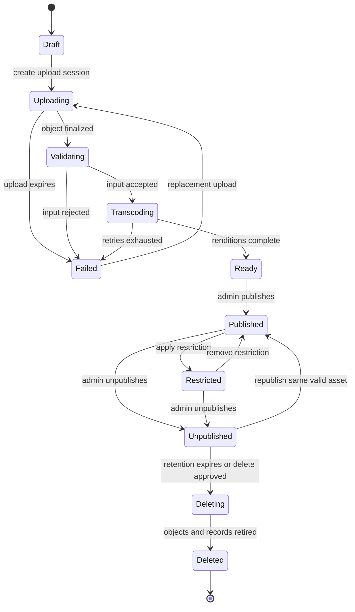

Unexpected transitions return `409`. Duplicate commands return the current converged state. Missing uploads expire and are cleaned. Publication is impossible without a validated immutable asset version.

### Subscription

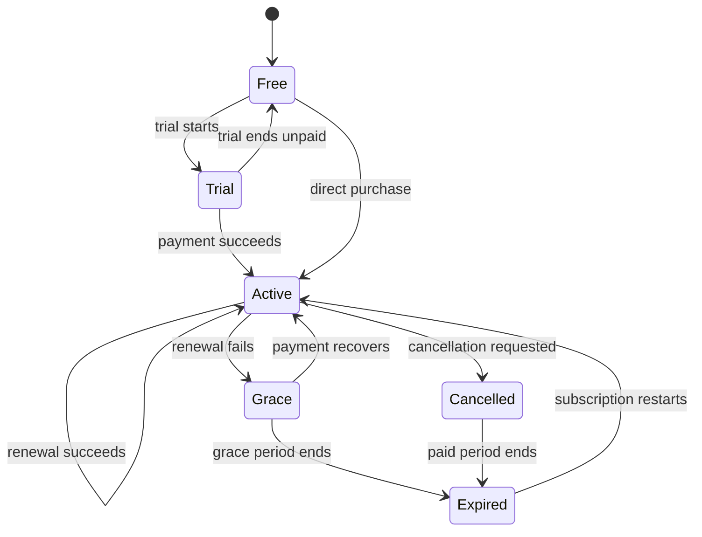

Provider event time and aggregate version control reordering; provider reconciliation repairs missed events.

### Playback grant

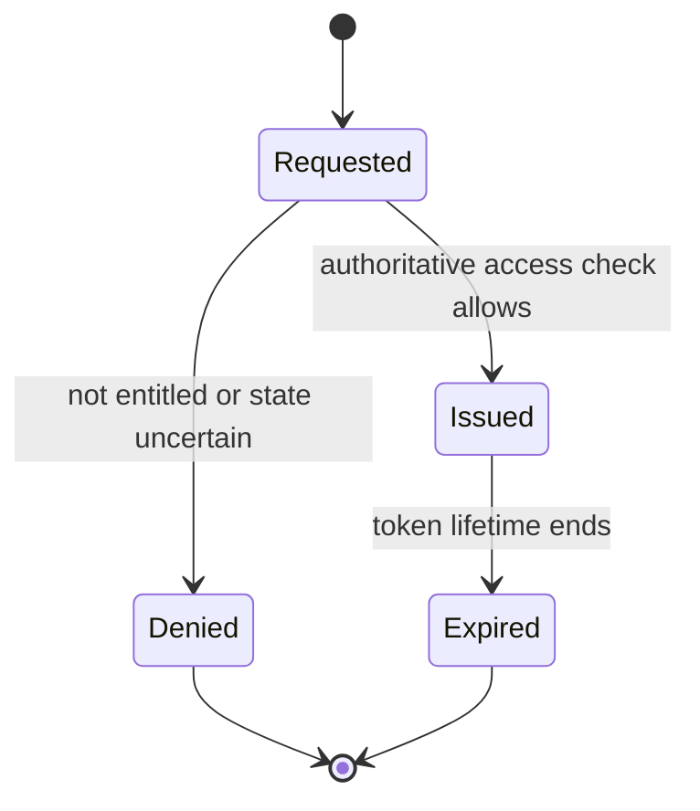

There is no promise to revoke an already issued edge capability instantly. Maximum token lifetime bounds exposure.

### Processing job

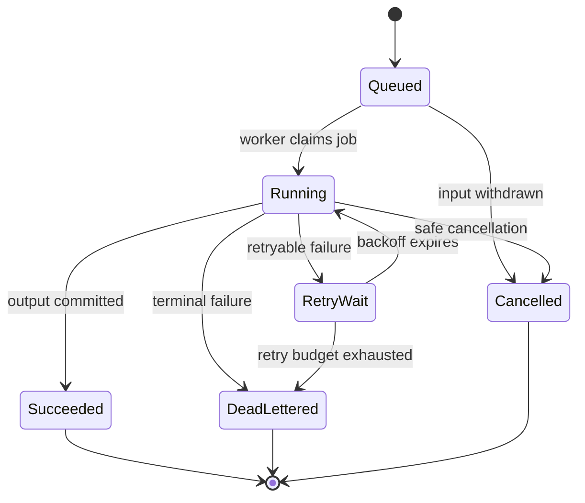

Retries are capped and idempotent; poison inputs are quarantined.

## 18. High-level design

| Requirement | Component |
|---|---|
| FR-1 to FR-4, FR-6, FR-8 | Modular Go API on GKE Autopilot |
| FR-3 media delivery | Media CDN + private delivery GCS |
| FR-5 ingestion | Go API + quarantine GCS + Pub/Sub + isolated jobs |
| FR-7 subscription | Webhook module + PostgreSQL + outbox |
| Durable asynchronous work | Pub/Sub subscriptions and DLQs |
| Transactional state | Cloud SQL PostgreSQL HA |
| Edge security | External Application Load Balancer, Cloud Armor, IAP for admin |
| Identity to GCP | Workload Identity Federation |
| Telemetry | Cloud Monitoring, Logging, Trace, Error Reporting |

## 19. Component responsibilities

- **Go API:** HTTP validation, identity/session handling, catalogue, entitlement checks, playback grants, admin commands, privacy workflows, transactions/outbox. Depends on PostgreSQL, KMS/Secret Manager, and Media CDN signing material. Fails closed for grants.
- **Event workers:** publish outbox events, consume Pub/Sub idempotently, update projections, reconcile providers, purge CDN. Dependency failure produces bounded retry then DLQ.
- **Media processor:** validates hostile media and creates renditions in an isolated resource boundary. It has no user-table access.
- **Cloud SQL:** transactional source of truth. Connection budget is centrally configured and tested through failover.
- **GCS/CDN:** quarantine and immutable delivery buckets; CDN handles segment delivery and token validation.
- **Optional Redis:** rate limiting/idempotency acceleration only if PostgreSQL/local mechanisms fail measured targets. The API remains correct if Redis is unavailable.

## 20. Data model

Core tables use `UUID` IDs, `TIMESTAMPTZ`, explicit foreign keys, check constraints, and `version BIGINT` for optimistic concurrency:

```text
users, sessions, subscription_accounts, subscription_events,
videos, media_assets, video_restrictions,
watch_sessions, watch_progress_events,
idempotency_keys, processing_jobs,
admin_actions, outbox_events
```

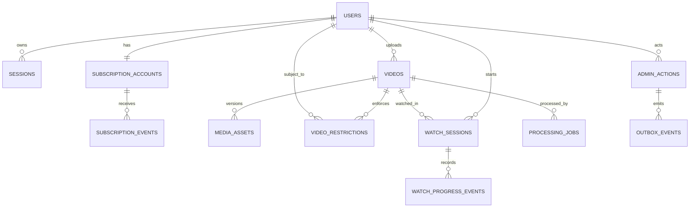

- Unique normalized email index; unique provider event ID; unique asset checksum/version; partial indexes for published videos and pending jobs.
- No index is added without an observed query and `EXPLAIN (ANALYZE, BUFFERS)` evidence.
- Event/audit tables are monthly partition candidates only after volume proves the need.
- Watch raw events: 90 days; durable watch summary until erasure. Idempotency keys: 24-72 hours. Audit: policy-defined, initially one year. Failed quarantine objects: seven days. Soft-deleted media: 30 days unless legal hold.
- Migrations use expand/backfill/switch/contract. Deployments never require an immediately destructive migration. Forward and rollback compatibility are tested.

## 21. Decision log

| Decision | Rationale | Alternatives | Consequences | Reversible | Owner |
|---|---|---|---|---|---|
| Modular API before microservices | One operator; avoids synchronous failure chains | Four domain services | Less independent scaling initially | Yes | Backend |
| GKE Autopilot | Required GKE with reduced node operations | Standard GKE, Cloud Run | Resource constraints and managed pricing | Yes | Platform |
| HLS adaptive delivery | Startup/resilience/bandwidth control | Direct MP4 | Requires transcoding | Costly but yes | Product/backend |
| Media bytes bypass GKE | Prevent bandwidth bottleneck | API proxy | Less per-byte application control | No practical reason to reverse | Backend |
| PostgreSQL only initially | Transactional consistency and simpler operations | MongoDB/Neo4j | Derived workloads may move later | Yes | Backend |
| Pub/Sub at-least-once + idempotency | Managed durable workflow | Kafka, in-process queue | Duplicate handling required | Yes | Backend |
| Workload Identity | Removes static keys | Service-account keys | IAM setup required | No | Security |
| No service mesh initially | Low service count | Istio | Add only with evidence | Yes | Platform |
| Direct-to-GCS upload | Removes large bodies from API | Multipart through API | More client workflow | Yes | Backend |

## 22. Tradeoff analysis

| Concern | Option A | Option B | Decision | Cost |
|---|---|---|---|---|
| Simplicity | Modular API | Microservices | Modular API | Larger deployable |
| Playback | HLS ABR | MP4 | HLS | Processing/storage variants |
| Availability | Regional HA | Multi-region active-active | Regional HA launch | Regional outage downtime |
| Cache | Add Redis now | Measure first | Measure first | Potential later migration |
| Authorization | Short token | Long token | Duration-bounded scoped token | Sharing window vs refresh complexity |
| Telemetry | 100% traces | Tail/adaptive sampling | Sampled | Some successful traces omitted |

## 23. Risk register

| Risk | Impact | Likelihood | Mitigation | Owner | Status |
|---|---|---|---|---|---|
| Egress destroys unit economics | Critical | High | Pricing model, ABR, budgets, commercial rate | Product | Open blocker |
| 10k target is undefined/misread | Critical | High | Treat as simultaneous streams; validate | Product | Clarified pending approval |
| Cloud SQL connection exhaustion | High | Medium | Global pool budget, admission control, load test | Backend | Open |
| Malicious media compromises worker | Critical | Medium | Isolation, patched FFmpeg, no broad IAM | Security | Open |
| Token sharing/content leakage | High | Medium | Scoped tokens, short bounded life, optional client binding/DRM later | Product | Accepted for no-DRM v1 |
| Single engineer unavailable | High | High | Automation, runbooks, external escalation | Business | Unresolved |
| Regional outage | High | Low/medium | IaC, cross-region recovery data, drills | Platform | Phase 3 |
| Observability cost/cardinality | Medium | Medium | sampling, exclusions, label review | Platform | Open |

## 24. Failure modes

| Failure | Detection/blast radius | Mitigation/recovery | Residual risk |
|---|---|---|---|
| Cloud SQL unavailable | DB errors; login/grants/admin affected | Shed traffic, fail grants closed, reconnect after HA failover | Existing playback may continue until token expiry |
| Pub/Sub backlog | Oldest-unacked age; derived state/jobs delayed | Autoscale bounded consumers, DLQ poison messages | Stale analytics/progress |
| Media CDN fault/misconfiguration | Playback errors and origin anomalies | Config rollback; controlled direct-origin fallback only if security reviewed | Cost spike or outage |
| GCS delivery unavailable | Segment failures | Stop grants, alert, recover service/config | Playback interruption |
| Bad deployment | SLO burn after rollout | Canary, automated halt, rollback | Migration may constrain rollback |
| Credential/signing-key leak | anomalous grants/usage | rotate keyset, revoke route/key, investigate | Tokens valid during overlap |
| Runaway traffic | QPS/bandwidth/billing alarms | Cloud Armor, quotas, rate limits, kill switches | Legitimate users rejected |

## 25. Dependency failures

- **Database:** Cloud SQL HA is for zonal failure. Read replicas are not writable fallback without promotion. Test connection recovery and approximately minute-scale interruption.
- **Network:** all calls have deadlines; retries apply only to eligible idempotent operations with jitter and a total retry budget.
- **Cache:** correctness does not depend on cache availability; bypass with stricter admission control.
- **Payment provider:** webhook receipt is durable and idempotent; periodic reconciliation repairs missed events.
- **Human error:** production changes require review/plan output; dangerous IAM/storage actions use retention, policy checks, and break-glass logging.
- **Malicious actors:** Cloud Armor, identity/IP/device signals where lawful, per-principal and global limits, and billing anomaly response.

## 26. Threats, abuse, and hostile conditions

- Validate JSON depth, lengths, enum values, pagination, upload size/checksum, MIME by content, and media parser output.
- Rate limit by endpoint, identity, IP/network risk, and global budget; never trust one dimension.
- Use request deadlines, bounded queues, circuit breakers, bulkheads, and retry budgets.
- Sign CDN tokens with rotated keys and opaque paths; do not put PII in URLs.
- Enforce least privilege per workload and separate quarantine, processor, and delivery identities.
- Pin and scan dependencies/images; produce SBOM and provenance; use distroless runtime images where operable.
- Audit admin, security, entitlement, key, IAM, and content lifecycle actions.
- Kill switches disable new grants, uploads, publication, webhook effects, or optional enrichment independently.

## 27. Final architecture

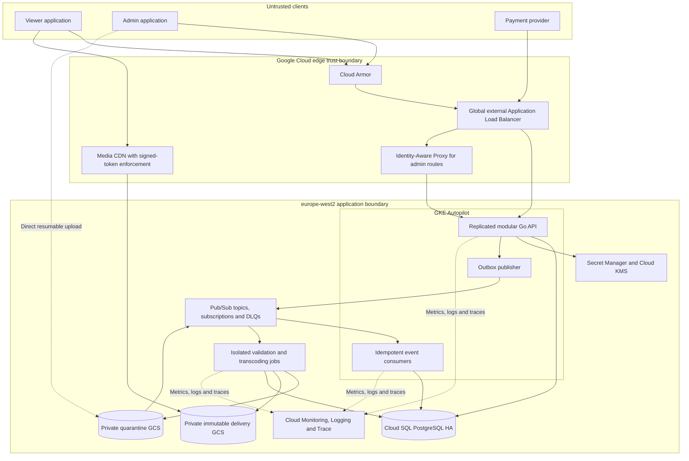

Synchronous calls are client-to-API and API-to-managed data/security services. Domain modules communicate in-process. Asynchronous side effects use transactional outbox plus Pub/Sub. Trust boundaries exist at client/edge, workload identity, processing sandbox, data stores, and external payment provider.

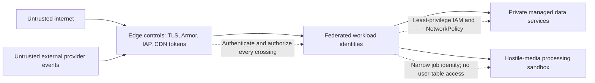

Fallbacks are deliberately limited: safe catalogue cache for DB read failure, cache bypass, and read-only administration. Authorization does not fail open. Direct GCS delivery is not an automatic fallback because it can bypass edge controls.

## 28. Deployment strategy

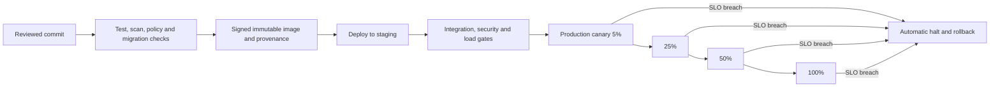

- Trunk-based immutable images identified by digest; separate dev, staging, and production projects.
- CI runs formatting, unit/integration tests, static analysis, vulnerability/license checks, migration tests, image signing, and policy checks.
- Production uses a 5% canary, then 25%, 50%, and 100% with SLO gates and automatic halt.
- Feature flags are typed, owned, expiring, and unavailable as arbitrary remote code paths.
- Rollback restores the previous image/config. Database changes follow expand/contract so rollback remains possible.
- Infrastructure plans are reviewed; emergency changes are reconciled immediately into source control.

## 29. Validation strategy

- Unit tests cover domain state machines, authorization truth tables, token scope/expiry, and event idempotency.
- Integration tests use real PostgreSQL and emulator/test-project boundaries for GCP integrations.
- Contract tests validate external API, events, payment webhooks, and Media CDN token generation.
- Load tests prove 500 RPS baseline and 1,500 RPS qualification while 10,000 CDN playback sessions are independently simulated.
- Soak test: four hours at expected peak; burst: 3x API traffic for ten minutes; no unbounded queue/connection growth.
- Security tests cover origin bypass, IAP bypass, horizontal privilege escalation, malicious media, SSRF, injection, replay, and dependency/image scanning.
- Chaos tests kill pods, interrupt Redis if present, force Cloud SQL failover, delay Pub/Sub, and exhaust configured dependency pools.
- Migration tests run upgrade, mixed-version operation, rollback-compatible app deploy, and restore from production-like volume.
- Acceptance evidence is retained as a versioned launch report; “10k supported” is forbidden before it passes.

## 30. Observability

- Metrics: request rate/error/latency by low-cardinality route; active streams estimate; grants; DB pool saturation; query latency; Pub/Sub age/DLQ; job duration/failure; CDN throughput/cache ratio/4xx/5xx; GCS operations; billing and unit cost.
- Logs: structured, severity-controlled, request/trace ID, no tokens/passwords/signed URLs, sampled successful access logs, retention by class.
- Traces: 1-5% baseline successes, 100% errors/slow requests where feasible, temporary incident sampling. Never 100% unconditional production tracing.
- Alerts use multi-window SLO burn rates plus hard safety alarms for billing, origin access, DLQ, database saturation, and signing-key events.
- Dashboards: user journey, API/dependencies, media pipeline, CDN/cost, security, and release comparison.

## 31. Auditability

Every privileged or security-relevant action records actor identity/type, action, target, before/after or change set, timestamp, reason/ticket where required, request/trace ID, source address, authenticated admin identity, application version, and result. Audit rows are append-only, access-controlled, exported to a separate retention boundary, and reconciled against transactional outbox sequences.

## 32. Operations

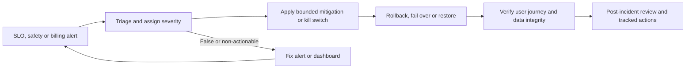

- Runbooks: high API errors, DB saturation/failover, CDN playback failure, origin exposure, Pub/Sub backlog, failed transcoding wave, signing-key compromise, cost spike, rollback, restore, and regional rebuild.
- Incident levels define response owner, communication, mitigation authority, evidence preservation, and post-incident review.
- Cloud SQL automated backups and PITR are enabled; restore is tested monthly. GCS uses versioning/retention appropriate to each bucket. IaC and manifests remain in Git.
- Zonal recovery uses Cloud SQL HA and multi-zone GKE placement. Regional recovery has a documented secondary region, replicated/recoverable data, capacity assumptions, DNS/routing steps, and quarterly exercises before an RTO is promised.

## 33. Launch readiness checklist

- [ ] Workload assumptions and CDN commercial pricing approved.
- [ ] 10,000-session/CDN and 1,500-RPS/API qualification passed.
- [ ] Monthly and per-viewer-hour cost model validated from a test bill.
- [ ] Dashboards, SLOs, paging alerts, billing alerts, and log exclusions configured.
- [ ] Canary halt and application rollback tested.
- [ ] Cloud SQL failover, backup restore, and queue recovery tested.
- [ ] Origin bypass, admin authorization, token replay, and malicious upload tests passed.
- [ ] No static service-account keys; IAM review complete.
- [ ] Runbooks exercised and escalation coverage agreed.
- [ ] GDPR export/erasure and retention controls tested.
- [ ] No unresolved critical/high exploitable vulnerabilities.

## 34. Extension points

- Recommendation provider is an internal interface fed by versioned derived data; Vertex AI can be added asynchronously.
- Search repository can move from PostgreSQL search to a dedicated engine behind the same query contract.
- Analytics events can feed BigQuery without making BigQuery part of the request path.
- DRM, multi-region routing, and additional rendition ladders are explicit future architecture projects, not hidden flags.
- A module becomes a service only when independent scaling, isolation, release cadence, or team ownership supplies measured benefit.

## 35. Migration paths

- Legacy-to-v1 uses shadow catalogue reads, data reconciliation, test-user playback, percentage canary, then DNS/client cutover.
- PostgreSQL changes use expand/backfill/switch/contract and resumable bounded backfills.
- Events are versioned additively; consumers tolerate old/new versions during migration.
- CDN asset versions are immutable; manifests switch atomically and old versions expire after active grants.
- Service extraction, if needed, starts with an internal interface and outbox events before network separation.

## 36. Technical debt

Accepted launch debt:

- Single primary region; regional recovery is not active-active.
- No DRM; signed tokens reduce casual sharing but do not prevent capture.
- Basic editorial/popularity recommendations.
- PostgreSQL search and watch summaries until measured limits.
- One deployable API, accepting broader blast radius for materially lower operational complexity.

Each debt item requires an owner, trigger metric, review date, and migration outline. “Future” without a trigger is not a plan.

## 37. Deprecation strategy

API and event usage is measured before deprecation. Breaking API versions receive documentation, deprecation and sunset headers, client-owner notification, and a minimum supported migration window. Old event consumers are identified by subscription telemetry. Feature flags have expiry dates and removal issues. Data fields are removed only after read/write telemetry and a completed backfill/rollback window.

## 38. Future assumptions

Revisit the architecture if any trigger occurs:

- Peak exceeds 10,000 streams or 1,500 control-plane RPS.
- Average bitrate, geographic distribution, or monthly transfer changes unit economics by >20%.
- Catalogue reaches 100 TB or 1 million videos.
- A second engineering team needs independent ownership.
- RTO requires regional active-active operation.
- Licensed content requires DRM or forensic watermarking.
- PostgreSQL p95 query latency exceeds target after query/index correction and vertical scaling.

## 39. Decision rationale and rejected alternatives

- **Four initial microservices rejected:** they add synchronous failure and operating cost without separate teams or demonstrated scaling boundaries.
- **Standalone RBAC service rejected:** playback authorization is a transactional domain operation, not a mandatory network hop.
- **MongoDB/Neo4j rejected for v1:** no workload requires their distinct consistency/query models yet.
- **Istio rejected initially:** service count and threat model do not justify mesh complexity.
- **Direct MP4 rejected as primary:** it cannot provide the same adaptive bitrate and startup behaviour across devices/networks.
- **Proxying media through Go rejected:** it makes GKE a costly bandwidth bottleneck.
- **Service-account keys rejected:** Workload Identity Federation provides short-lived workload credentials.
- **100% tracing rejected:** excessive cost and volume; metrics plus adaptive sampling provide better operational value.
- **Automatic direct-GCS fallback rejected:** it risks bypassing edge authorization and creating uncontrolled egress.

## 40. Future maintainer notes

1. Never claim 10,000-user capacity without the versioned qualification report and its bitrate/traffic assumptions.
2. CDN transfer, not Go compute, is likely the dominant cost. Watch cost per viewer-hour continuously.
3. Never proxy normal media delivery through the API and never authorize each HLS segment through PostgreSQL.
4. Do not make the private origin public to repair a CDN incident.
5. An IAP-authenticated person is not automatically an application administrator.
6. A read replica is not a writable HA standby. Test Cloud SQL failover and connection recovery.
7. Keep total database connections bounded as pod count changes.
8. Every Pub/Sub consumer must be idempotent; duplicates are normal.
9. Treat FFmpeg and uploaded media as hostile. Keep processors isolated and narrowly authorized.
10. A cache may improve availability or destroy authorization correctness. Document staleness before caching.
11. Do not add a datastore, service, mesh, or dashboard because it is fashionable. Require an observed constraint and an owner.
12. Recovery objectives become promises only after repeated timed exercises.

---

## Approval gates

Implementation may begin with discovery and prototypes. Production launch requires explicit approval of:

1. The definition of 10,000 simultaneous playback sessions.
2. The bitrate/session/peak-duration workload model.
3. CDN pricing and maximum monthly media-delivery budget.
4. The accepted no-DRM content-protection risk.
5. The single-engineer support and incident-response model.
6. Evidence from load, failover, restore, security, and cost qualification.
